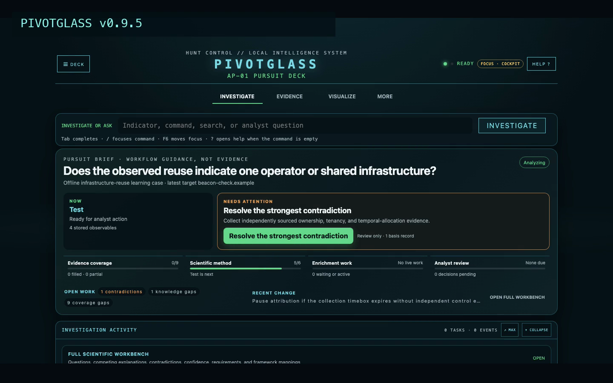
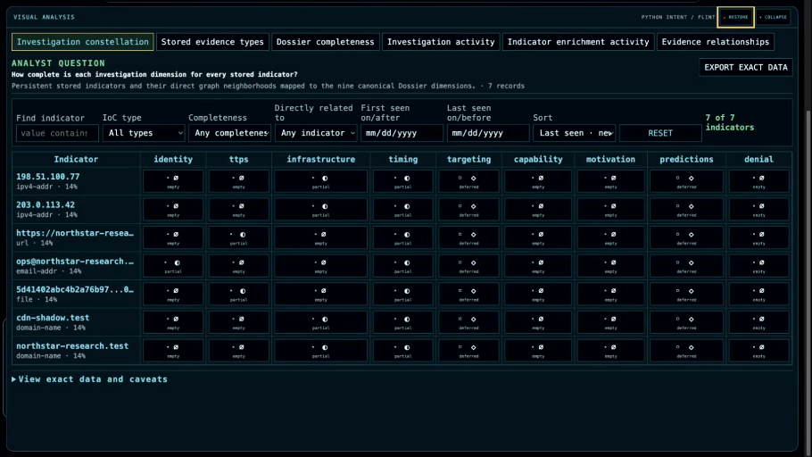
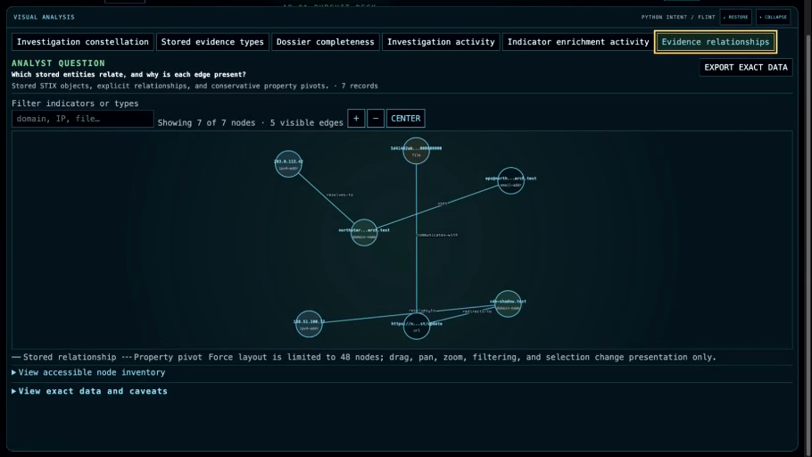
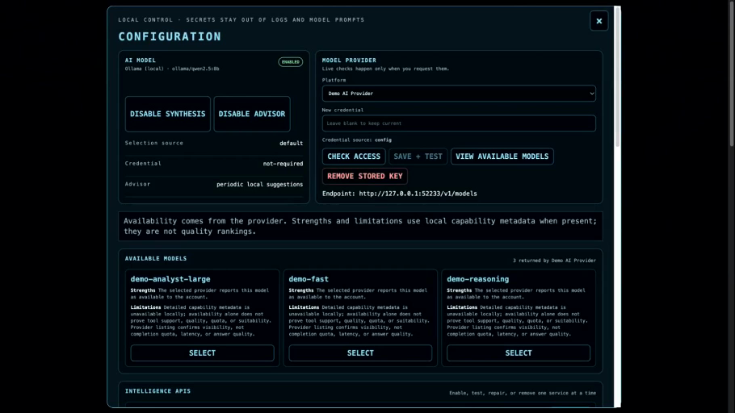
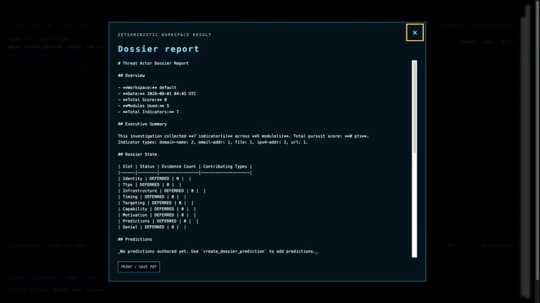

# Pivotglass

Pivotglass is a local, AI-augmented workspace for cyber-threat investigation.
Start with one clue. Pivotglass enriches it through intelligence services,
preserves every result with provenance, connects only supported relationships,
shows what remains unknown, and turns the investigation into a defensible
report.

> An indicator is not the answer. It is the first node.

The installed command remains `ap` for compatibility with earlier releases.
The Python distribution is `adversary-pursuit`, and local configuration and
workspaces remain under `~/.ap/`.

Current release: **v0.8.5 early availability**.

[](docs/media/pivotglass-guided-demo-v0.7.0.mp4)

**[Watch or download the two-minute guided walkthrough](docs/media/pivotglass-guided-demo-v0.7.0.mp4)** ·
**[Read the transcript](docs/media/pivotglass-guided-demo-transcript.md)**

The walkthrough uses synthetic indicators and a local mock model provider. It
shows startup, safe credential setup, model discovery and selection,
enrichment, the Investigation Constellation, graph pivots, reporting, and the
Default Analyst, Sherlock Holmes, and Neuromancer modes.

## The investigation model

```text
clue → enrichment → evidence → relationship → gap → pivot → report
```

1. Enter an IP address, domain, URL, email address, or file hash.
2. Pivotglass schedules the applicable enrichment sources and records their
   authoritative lifecycle state.
3. Results are normalized into STIX 2.1 evidence with source and collection
   context.
4. The relationship graph shows actual indicators as nodes and justified
   relationships as directed edges.
5. The Dossier and Investigation Constellation make coverage and gaps visible.
6. The analyst chooses the next pivot, adds notes, and produces a report or
   structured export.

Version 0.8 adds a scientific investigation notebook around that operational
flow:

```text
question → competing explanations → predictions → collection → test → judgment
```

Assumptions, source-backed observations, analytic assertions, confidence,
likelihood, contradictions, and unresolved gaps remain separate records.
Structured Analytic Techniques are named and versioned. Pivotglass can point
out non-overlapping value claims or dependent reporting, but it cannot silently
promote a suggestion into a contradiction or change the analyst's confidence.

A model may explain, synthesize, or propose. It does not own collection,
storage, status, relationship admission, or successful-action claims. The
model can explain the case; it cannot rewrite the evidence.

## Quick start

Pivotglass requires Python 3.12 or newer. The shortest source installation uses
[uv](https://docs.astral.sh/uv/):

```bash
git clone --branch v0.8.5 --depth 1 https://github.com/jarocki/pivotglass.git
cd pivotglass
uv sync --extra agent
uv run ap --version
uv run ap
```

`uv run ap --version` should report `adversary-pursuit 0.8.5`. Pivotglass opens
at `http://127.0.0.1:8765` and listens only on the local computer by default.
The committed release already contains the built web interface; Node.js is
required only when changing that interface.

For the complete first investigation, configuration, graph, and reporting
walkthrough, follow the **[Pivotglass Quick Start](docs/QUICKSTART.md)**.

### Interfaces

```text
ap                 Local Pivotglass browser interface (default)
ap web             Same browser interface
ap tui             Full-screen terminal interface
ap chat            Alias for the terminal interface
ap basic           Direct module-control console
ap repl            Alias for the direct console
ap --help          Interface summary
ap --version       Installed version
```

The browser and terminal interfaces share the same workspaces, command grammar,
evidence, and investigation policies. The direct console retains the explicit
`use → set → run` workflow for individual modules.

## What you can see and control

### Investigation Constellation

Every stored indicator is a row; the nine Dossier dimensions are columns. The
newest indicators appear first. Sort or filter by value, indicator type,
mapped completeness, first or last seen, and direct graph relationship. A cell
can be filled, partial, empty, or deferred. That state is navigation help—not a
confidence score or malware verdict. Compact Lite Brite pegs keep all nine
dimensions visible: starburst is filled, striped round is partial, concentric
octagonal is deferred, and dark recessed is empty. Shape, hover text, keyboard
focus, and selection repeat the color meaning. Enrichment Activity retains its
three-channel RGB blocks for indicator enrichment jobs.



### Visual Analysis and relationship graph

Visual Analysis begins with an analyst question and chooses a view that fits
the stored data. Current views include evidence composition, Dossier radar,
UTC activity calendar, enrichment activity, the Constellation, and a
force-directed relationship graph. Each view includes source scope, caveats,
an accessible table, and export of the exact plotted data.

The graph labels nodes with actual indicator values. Every visible edge has a
stored or explicitly labeled conservative basis. Dragging, filtering, and
moving nodes change only the presentation. If no supported relationship
exists, Pivotglass leaves the nodes unconnected.



### Configuration and models

The Configuration dialog manages model synthesis and intelligence-service
credentials without leaving the investigation. Secrets are entered through
masked controls, sent only during an explicit save or test action, and are not
returned by ordinary state polling or written to logs, exports, analytics, or
model prompts. Environment-provided credentials remain read-only in the
interface.

Provider checks are explicit. The model catalog reports account-visible models
and local capability notes when available, while stating what a catalog cannot
prove: quota, latency, quality, and suitability for a particular case.



### Reports and exports

Reports are built from the active workspace rather than a model's memory. The
same evidence can be exported as JSON, CSV, STIX, or GEXF. Visual Analysis can
also export the exact rows, nodes, and edges behind the current view.



## Commands

Pivotglass and the terminal interface complete and execute the same local
command families:

- `workspace` — list, create, switch, validate schema, export, merge, or safely delete workspaces
- `mode` — list or select a character
- `model` — inspect, check, select, enable, disable, or repair model settings
- `config` — inspect, test, enable, disable, or repair intelligence APIs
- `use <indicator>` — set an investigation target
- `search`, `graph`, `dossier`, `gaps`, and `timeline` — inspect stored work
- `analysis` — record questions, hypotheses, assertions, confidence, likelihood, contradictions, and structured methods
- `note` — add analyst-authored context
- `report` and `export` — produce reports or portable data
- `autopivot` and `hint` — control optional assistance
- `challenges` — inspect pursuit-specific, source-grounded goals and progress
- `badges` — inspect durable awards from the 40-badge catalog; distinct artwork
  and rarity color make different milestones recognizable at a glance
- `status`, `clear`, `help`, `quit`, and `exit` — control the session

During an active investigation, `stop`, `focus`, `add`, and `skip` control the
current enrichment queue where the interface supports those actions. See the
[User Guide](docs/USER_GUIDE.md#command-reference) for exact syntax.

## Intelligence sources

Pivotglass ships 14 modules:

| Purpose | Sources |
| --- | --- |
| Network and host intelligence | Shodan, Censys, GreyNoise, AbuseIPDB |
| Threat intelligence | VirusTotal, AlienVault OTX, ThreatFox, URLhaus, MalwareBazaar |
| Domain and URL intelligence | WHOIS, crt.sh, URLScan, PassiveTotal |
| Identity exposure | Have I Been Pwned |

Most modules query provider-held intelligence rather than touching the
indicator directly. Pivotglass does not issue direct DNS queries from the
operator host. URLScan is different: it can submit a URL or domain to an
external browser-scanning service. Review each provider's terms and handling
before submitting sensitive or embargoed indicators.

WHOIS and crt.sh work without credentials. Other services may require an
account, API key, or paid access.

## Characters, accessibility, and sound

The public character deck contains Default (Analyst), Chuck Norris, HAL9000,
Troll, Sherlock Holmes, Neuromancer, and The Matrix. A character changes voice,
palette, atmosphere, music, and an optional diversion. It never changes the
meaning or order of evidence.

Music starts off, runs locally, and persists its enabled state when the
character changes. The procedural scores use original motifs, harmony,
counterlines, percussion, modeled instruments, and room ambience. The browser
schedules ahead and cross-fades to avoid gaps and hard audio edges. In-character
field guidance appears only after an extended pause in meaningful analyst work,
near the top of the current viewport without taking focus. Each Advisor card uses character- and advice-specific
artwork and remains labeled narration, not evidence. **Read Aloud** uses a
character-shaped rate and pitch profile with an available browser or operating-
system voice; automatic voice audio is off by default and never clones an actor.
Music, narration, animation, scores, and mini-games are presentation only.

Pivotglass includes Day, Night, high-contrast, reduced-motion, and effects-off
controls. Terminal equivalents include:

```bash
AP_TUI_COLOR_SCHEME=light ap tui
AP_TUI_HIGH_CONTRAST=1 ap tui
```

## Architecture and trust boundary

```text
operator
   │
   ├── ap / ap web ───────── local browser interface
   ├── ap tui / ap chat ──── terminal interface
   └── ap basic / ap repl ── direct module console
                │
        shared application services
                │
   modules ─ workspace ─ STIX ─ Dossier ─ graph ─ reports
      │
 deterministic local logic and explicitly enabled external APIs
```

The browser interface is a static build served by the Python process. It loads
no CDN scripts, remote fonts, analytics, or hosted UI code. Exact web
dependencies and integrity hashes are committed. See the
[web supply-chain policy](docs/WEB_SUPPLY_CHAIN.md).

## Documentation

- [Quick Start](docs/QUICKSTART.md) — installation through first report
- [User Guide](docs/USER_GUIDE.md) — complete task and command reference
- [Documentation index](docs/README.md) — current guides, design notes, QA, and historical plans
- [Procedural music](docs/PROCEDURAL_MUSIC.md) — composition and safety boundary
- [Changelog](CHANGELOG.md) — user-visible release history
- [Philosophy](PHILOSOPHY.md) — evidence, judgment, and collaboration principles
- [Contributor governance](AGENTS.md) — repository standards and protected scope

## Development

```bash
uv sync --extra agent
uv run pytest -q
uv run ruff check src tests
npm --prefix web ci
npm --prefix web run lint
npm --prefix web run build
```

The repository is `pivotglass`. The command `ap`, distribution
`adversary-pursuit`, import package `adversary_pursuit`, and `~/.ap/` data path
remain stable compatibility names.

## Status and license

Pivotglass is early-availability software. External intelligence can be
incomplete, stale, biased, or incorrect. Verify consequential findings at the
source, respect provider terms, and use the tool lawfully.

Licensed under the [MIT License](LICENSE).
