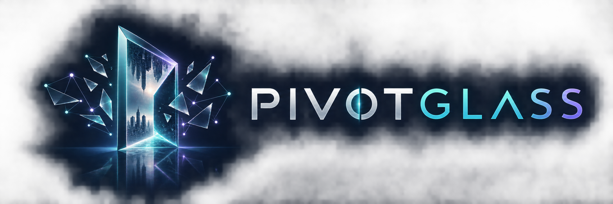
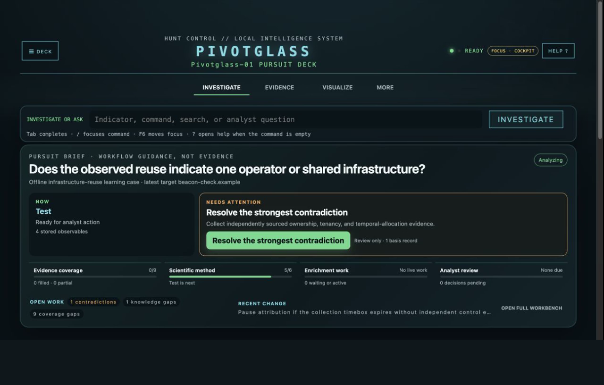
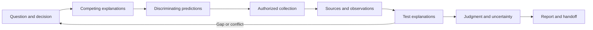

# Pivotglass



**Start with a question. Preserve the evidence. Make the reasoning inspectable.**

Pivotglass is a local investigation workspace for security and threat
intelligence analysts. It brings source intake, indicator enrichment,
provenance, relationship graphs, and a scientific analysis notebook into one
case. A report, alert, or suspicious domain is a starting point; the analyst
owns the question, the collection decision, and the final judgment.

Current release: **v1.1.0**.
The final assurance review approved the bounded local, single-analyst scope.
External integration previews and deferred intake remain outside that scope.

## Why it exists

An investigation can accumulate many indicators while answering very little.
Reports repeat upstream reporting, a shared address can suggest common control,
and a persuasive account can hide a missing time window. Reconstructing which
source supported which conclusion takes time, especially during a handoff.

Pivotglass keeps the evidence and reasoning together while preserving their
different meanings. It helps the analyst ask a useful question, admit source
material deliberately, trace relationships, test competing explanations, and
communicate what remains unknown.

| Analyst need | What the workspace provides | What remains an analyst decision |
| --- | --- | --- |
| Find a starting point | Pursuit Brief with the question, open work, and a proposed next action | Purpose, scope, and priority |
| Reduce repeated handling | Persistent cases across interfaces, deterministic normalization, reviewable document library, enrichment queue | Which data to admit and send to providers |
| Inspect a connection | Full indicator values, edge bases, provenance history, and exact-data exports | Whether the connection supports an explanation |
| Challenge an early theory | Hypotheses, predictions, assumptions, contradictions, and versioned structured techniques | Evidence stance, confidence, and judgment |
| Learn while working | Novice Q&A, unknown answers, reflection, and adjustable guidance | Readiness and feedback from a mentor |
| Hand off the case | Reports and structured exports from the active workspace | Handling, disclosure, and the recommended action |

These features target less repeated navigation and more reviewable reasoning.
They are design mechanisms, not measured productivity gains or proof of analyst
competence. Badges, coverage percentages, and finished enrichment jobs are not
threat verdicts or qualifications.


## Four ways through the looking glass

Start with the [flashy Overview](docs/media/series-v1.0.0/pivotglass-overview-v1.0.0.mp4), then choose the [Analyst Walkthrough](docs/media/series-v1.0.0/pivotglass-analyst-v1.0.0.mp4), [PIVOT Glass](docs/media/series-v1.0.0/pivotglass-pivot-v1.0.0.mp4), or [Visualization and Reporting](docs/media/series-v1.0.0/pivotglass-visualization-v1.0.0.mp4). Each has real Descript narration, original generative music, captions and a transcript in the [series guide](docs/media/series-v1.0.0/README.md).

## Earlier five-minute guided edit

[](docs/media/pivotglass-guided-demo-v1.0.0.mp4)

[Watch or download the v1.0.0 narrated tour](docs/media/pivotglass-guided-demo-v1.0.0.mp4) ·
[Captions](docs/media/pivotglass-guided-demo-v1.0.0.vtt) ·
[Transcript and chapter times](docs/media/pivotglass-guided-demo-transcript-v1.0.0.md) ·
[Caption-enabled player instructions](docs/QUICKSTART.md#watch-with-captions)

This edited tour uses actual current browser states in an isolated synthetic
case, with Descript’s Jesse neural voice synchronized to the chapter screens.
It demonstrates Q&A review and saving,
source admission, provenance branches, analyst grouping, evidence linking, and
optional configuration and presentation. It is not a continuous screen
recording or a live threat assessment. Follow the written guides for the full
analytical and report handoff exercises.

## Choose your first path

### New to Pivotglass or analytical practice

1. [Install and launch](docs/QUICKSTART.md).
2. Create an [offline learning case](docs/LEARNING_WORKSPACE.md), using a new
   workspace name. It requires no API key, model, account, or provider request.
3. Follow the [Novice question-framing exercise](docs/USER_GUIDE.md#walkthrough-from-reported-context-to-a-question).
   Use “I don't know yet” to preserve an information gap.
4. Work through the [synthetic analytical case](docs/analysis/WORKED_EXAMPLE.md)
   and practice challenging the explanation that first seems plausible.
5. [Reflect with a mentor](docs/analysis/LEARNING.md). Choose lighter interface
   guidance when ready; Pivotglass never certifies expertise from a click count.

### Experienced analyst

1. [Define the decision and question](docs/USER_GUIDE.md#experienced-path-a-bounded-investigation).
2. [Preview and admit sources](docs/USER_GUIDE.md#preview-ingest-and-revisit-a-document),
   preserving source hashes and exact extraction spans.
3. Review an admitted indicator, then explicitly choose whether to investigate
   it through enabled services. Intake alone never runs enrichment.
4. [Compare explanations and test predictions](docs/analysis/README.md).
5. [Read the visualizations](docs/analysis/VISUALIZATIONS.md), inspect their
   exact data, and trace any consequential claim back to its source.
6. [Correct judgments and prepare a handoff](docs/USER_GUIDE.md#review-correct-and-hand-off-a-case).

### Team lead or operator

Start with the [documentation index](docs/README.md),
[architecture](docs/architecture/README.md), [data safety](docs/DATA_SAFETY.md),
and [capacity and limits](docs/CAPACITY.md). A local case can support an analyst
handoff; the default browser server is not an authenticated multiuser service.
The operational guides explain implementation choices and upkeep.

## Install and run

Python 3.12 or newer, Git, and [uv](https://docs.astral.sh/uv/) are required.
The release-tagged source and committed dependency lock are the supported
reproducible installation for v1.1.0.

```bash
git clone --branch v1.1.0 --depth 1 https://github.com/jarocki/pivotglass.git
cd pivotglass
uv sync --extra agent --frozen
uv run pivotglass --version
uv run pivotglass
```

Expected version: `pivotglass 1.1.0`. The local browser opens at
`http://127.0.0.1:8765`. The release includes the built browser assets; Node.js
is needed only to rebuild them. Follow the [Quick Start](docs/QUICKSTART.md)
for update, uninstall, data migration, configuration, and recovery.

The command, Python distribution, and import package are `pivotglass`.
Default user-owned data is under `~/.pivotglass/`. Application removal does
not erase case data. Copying an older data directory is an explicit migration
operation, separate from workspace schema migration.

| Interface | Command | Use |
| --- | --- | --- |
| Browser cockpit | `pivotglass` or `pivotglass web` | Default investigation, notebook, graphs, reports, and configuration |
| Full-screen terminal | `pivotglass tui` or `pivotglass chat` | Keyboard-oriented investigation over the same local case authorities |
| Direct module console | `pivotglass basic` or `pivotglass repl` | Explicit `use → set → run` module operation |


## The investigation loop


```mermaid
flowchart LR
    Q["Question and decision"] --> H["Competing explanations"]
    H --> P["Discriminating predictions"]
    P --> C["Authorized collection"]
    C --> E["Sources and observations"]
    E --> T["Test explanations"]
    T --> J["Judgment and uncertainty"]
    J --> R["Report and handoff"]
    T -->|"Gap or conflict"| Q
```

This diagram describes the analytical process, not an automatic execution
pipeline. Collection, review, hypothesis disposition, confidence, and reporting
are distinct actions. Pivotglass supplies named, versioned Structured Analytic
Technique protocols; it preserves authored inputs, results, and dispositions.
It does not compute the correctness of an argument or silently accept a finding.

The [user guide](docs/USER_GUIDE.md) connects the process to interface actions.
The [method walkthroughs](docs/analysis/README.md) explain how to reason about
the resulting records.

## What each view helps you do

| View | Useful analyst question | Interpretation boundary |
| --- | --- | --- |
| Pursuit Brief | What needs attention next? | Recommendation is navigation guidance |
| Investigation Constellation | Which evidence dimensions are present or missing? | Coverage is neither confidence nor maliciousness |
| Relationship Graph | What supported or explicitly authored connections exist? | Proximity, shared property, or analyst grouping does not prove common control |
| Provenance History | How did this source, promotion, or pivot enter the case? | Workflow history does not establish an adversary relationship |
| Competing hypotheses matrix | Which records support or challenge each explanation? | Unassessed is a gap; no automatic winning hypothesis |
| Likelihood and confidence | How probable is the claim, and how strong is its basis? | Probability and confidence are separate judgments |

Use the [visual examples and reading exercises](docs/analysis/VISUALIZATIONS.md)
before treating a chart as a conclusion. Each view provides source scope,
caveats, and export of the exact displayed data. Graph filters and saved layouts
change presentation; they never remove underlying evidence.

## Collection, automation, and authority

Pivotglass ships intelligence modules for Shodan, Censys, GreyNoise,
AbuseIPDB, VirusTotal, AlienVault OTX, ThreatFox, URLhaus, MalwareBazaar,
WHOIS, crt.sh, URLScan, PassiveTotal, and Have I Been Pwned. Availability depends
on provider access, configuration, and terms. WHOIS and crt.sh need no API key.

Most modules query provider-held data. URLScan can submit a URL or domain to an
external browser-scanning service. Review enabled providers and data handling
before submitting sensitive indicators. No model is required to collect and
organize evidence or to use the offline case.

Optional AI can explain or propose. It cannot take ownership of evidence,
collection lifecycle, relationships, or successful-action claims. External
Synapse, SCOT4, go-roast, and Nucleotide workflows have separate authority and
approval boundaries; see the [integration guide](docs/EXTERNAL_INTEGRATIONS.md)
and [maturity matrix](docs/COMPATIBILITY.md) rather than assuming production
cutover is complete.

Characters, Day/Night palettes, quiet mode, larger text, reduced motion, and
local original music support different working preferences. Music is optional
and presentation-only. Advisor voice is separately opt-in; configured OpenAI
speech synthesis receives narrated text, with device speech as a fallback.
See [accessibility and sound](docs/USER_GUIDE.md#characters-accessibility-and-sound)
and [data safety](docs/DATA_SAFETY.md).

## Documentation and development

- [User Guide](docs/USER_GUIDE.md): task instructions, corrections, and command reference.
- [Documentation index](docs/README.md): user, analysis, operational, architecture, and historical reading paths.
- [Architecture](docs/architecture/README.md): state authorities, data flows, and boundaries.
- [Failure and recovery](docs/FAILURE_RECOVERY.md): honest failure states and safe next steps.
- [Support](SUPPORT.md): supported versions and safe reporting.
- [Changelog](CHANGELOG.md): release changes.
- [Project philosophy](PHILOSOPHY.md): evidence, judgment, and collaboration.

```bash
uv sync --extra agent --frozen
uv run pytest -q
uv run ruff check src tests
npm --prefix web ci
npm --prefix web test
npm --prefix web run lint
npm --prefix web run build
```

Pivotglass is pre-v1.0 software. Review [compatibility](docs/COMPATIBILITY.md),
[release trust](docs/RELEASE_TRUST.md), and handling requirements before
consequential use. Licensed under the [MIT License](LICENSE).
