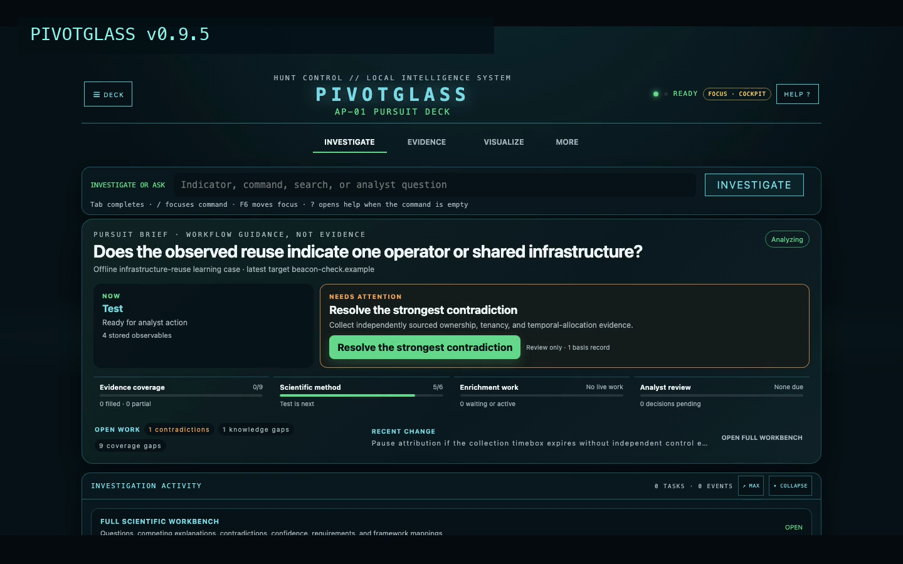
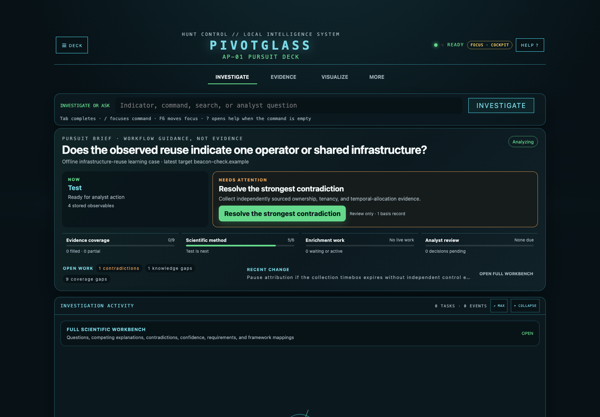
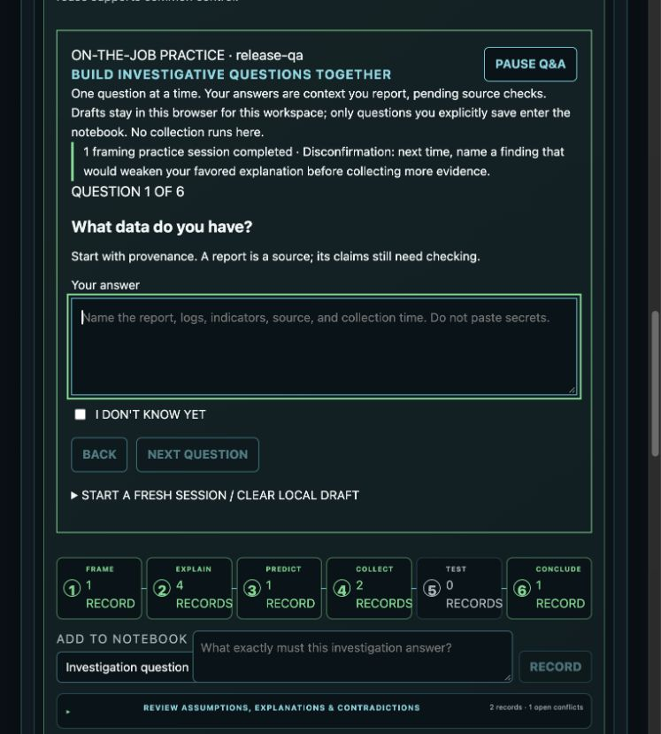
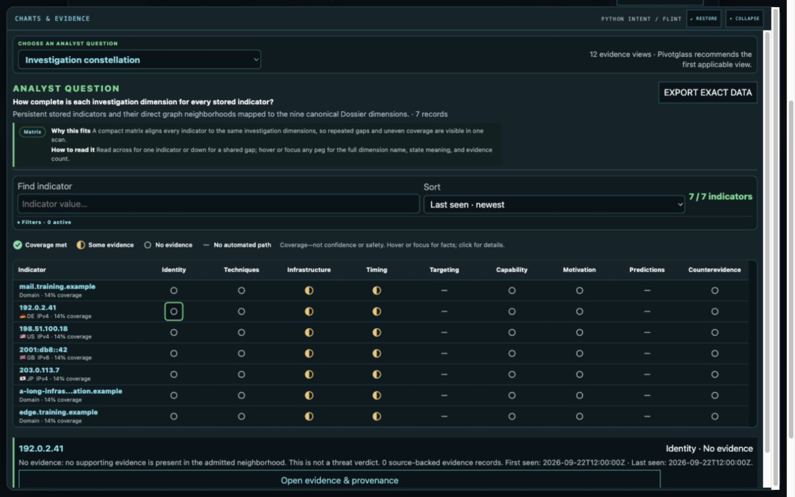
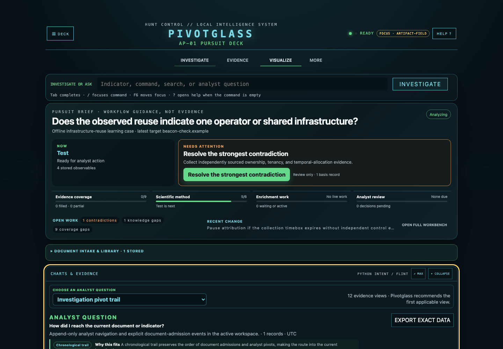
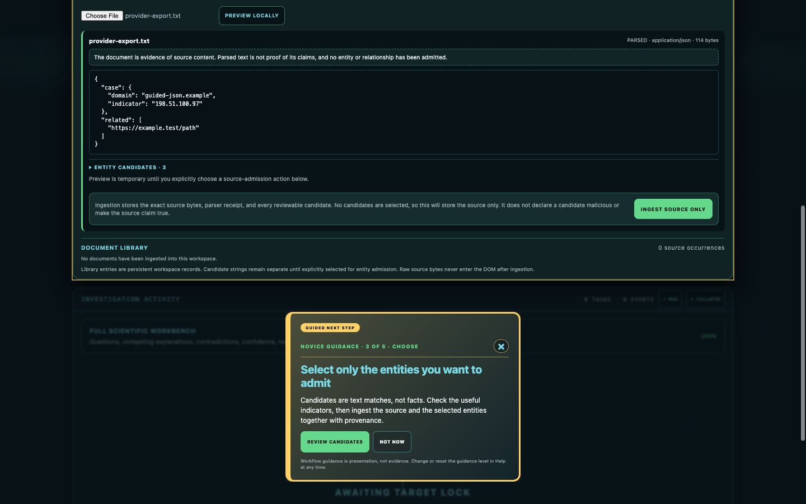
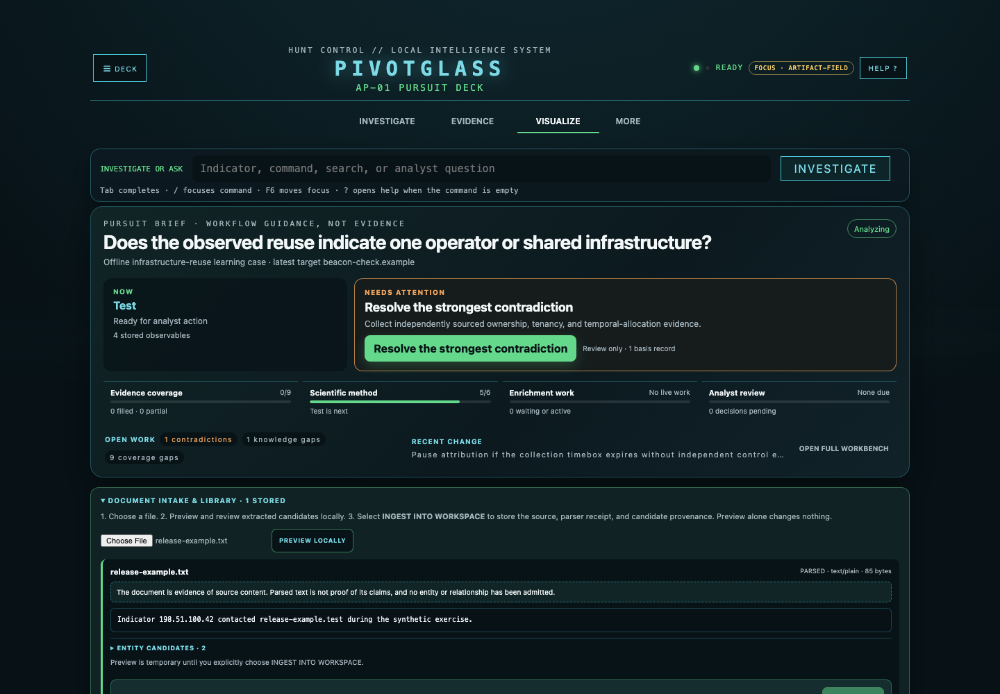
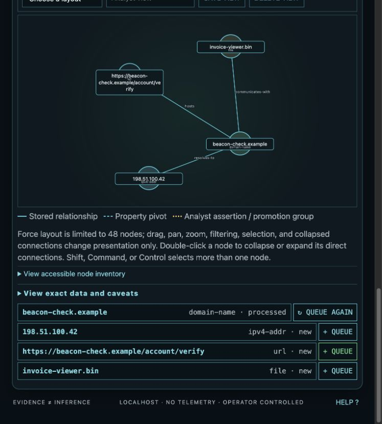
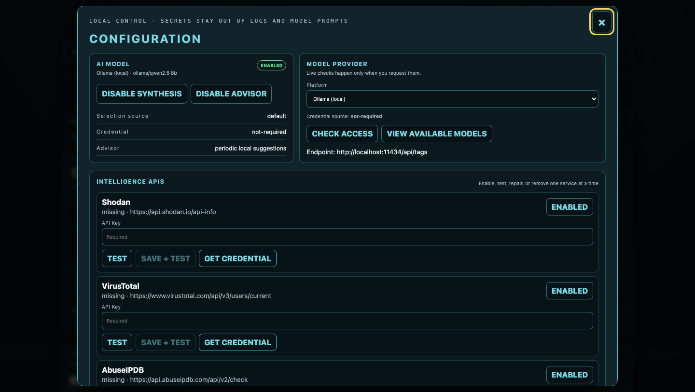
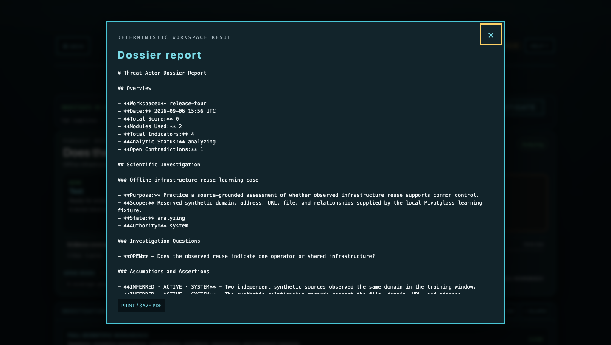

# Pivotglass

Pivotglass is a local, AI-augmented workspace for cyber-threat investigation.
Start with a question and the clues you have. Choose what to collect, keep
source provenance visible, compare explanations, and produce a report whose
reasoning another analyst can inspect.

## From a clue to a defensible judgment

An alert, a suspicious domain, or a report can start an investigation. The hard
part is deciding what the evidence means: which sources are independent, what
else could explain the activity, what remains unknown, and what finding would
justify action. More indicators alone cannot answer those questions.

Pivotglass brings the collection workflow and the reasoning notebook into one
local workspace. It helps analysts preserve sources, inspect relationships,
compare explanations, plan the next collection, and explain their judgment to
someone who must act on it.

| What the analyst needs | What Pivotglass provides | What still requires judgment |
| --- | --- | --- |
| A clear starting point | A Pursuit Brief with the active question, open work, and a proposed next step | The question, priority, and decision to support |
| Less repeated handling | Persistent case workspaces across interfaces, deterministic normalization, a reviewable source library, and an enrichment queue | Which data is appropriate to admit or send to providers |
| Connections that can be checked | Relationship and provenance graphs with labeled edge bases | Whether a connection supports a particular explanation |
| A way to challenge an early theory | Competing hypotheses, predictions, contradictions, gaps, and versioned structured techniques | Evidence assessment and the final judgment |
| Practical learning during work | Novice Q&A, explicit unknowns, reflection, and optional lighter guidance | Readiness, competence, and supervisory feedback |
| A usable handoff | Source-grounded reports and structured exports | Handling, redaction, and the action recipient should take |

These features are designed to improve efficiency by reducing repeated
navigation and data handling, and effectiveness by making reasoning inspectable.
They do not establish a measured productivity gain or certify analyst expertise.

**Start here:** [install and run](docs/QUICKSTART.md) ·
[complete an offline case](docs/LEARNING_WORKSPACE.md) ·
[use the full guide](docs/USER_GUIDE.md) ·
[learn the analytical method](docs/analysis/README.md).

Current release: **v0.9.8**. This is the documentation, naming, and release-quality
checkpoint before the planned v0.9.9 marketing and operational documentation
work and the separately approved v1.0.0 quality gate. See the
[Changelog](CHANGELOG.md) for implementation history, the
[compatibility matrix](docs/COMPATIBILITY.md) for capability maturity, and
[data ownership and safety](docs/DATA_SAFETY.md) before enabling providers or
LAN access.

The command, Python distribution, and import package are `pivotglass`.
Local application data belongs under `~/.pivotglass/`.

[](docs/media/pivotglass-guided-demo-v0.9.5.mp4)

**[Watch or download the two-minute guided walkthrough](docs/media/pivotglass-guided-demo-v0.9.5.mp4)** ·
**[Captions](docs/media/pivotglass-guided-demo-v0.9.5.vtt)** ·
**[Read the transcript](docs/media/pivotglass-guided-demo-transcript.md)**

The v0.9.5 walkthrough remains a short tour of the core workflow. It uses only
the offline synthetic learning workspace and shows
the Pursuit Brief, scientific notebook, contradiction and gap handling, local
document preview, the Investigation Constellation, relationship graph,
deterministic reporting, sanitized configuration, responsive layout, and the
Default Analyst, Sleuth, and Nightgrid modes. No credential, model
request, provider account, or live indicator is used.



## Guided questions and practice

Novice Q&A helps an analyst frame the case through six prompts: data, event,
origin, scope, decision, and alternatives. “I don't know yet” preserves a gap.
Review and edit the suggested questions before explicitly saving them to the
notebook. Answers and reflections stay browser-local; a question save does not
run collection. Repeated lessons encourage source checks, disconfirmation, and
reflection. The analyst chooses when to reduce interface guidance.



## The investigation model

```text
clue → enrichment → evidence → relationship → gap → pivot → report
```

1. Enter an IP address, domain, URL, email address, or file hash.
2. Pivotglass schedules the applicable enrichment sources and records their
   authoritative lifecycle state.
3. Results are normalized into STIX 2.1 evidence with source and collection
   context.
4. The relationship graph shows actual indicators as nodes and justified
   relationships as directed edges.
5. The Dossier and Investigation Constellation make coverage and gaps visible.
6. The analyst chooses the next pivot, adds notes, and produces a report or
   structured export.

Version 0.8 adds a scientific investigation notebook around that operational
flow:

```text
question → competing explanations → predictions → collection → test → judgment
```

Assumptions, source-backed observations, analytic assertions, confidence,
likelihood, contradictions, and unresolved gaps remain separate records.
Structured Analytic Techniques are named and versioned. Pivotglass can point
out non-overlapping value claims or dependent reporting, but it cannot silently
promote a suggestion into a contradiction or change the analyst's confidence.

A model may explain, synthesize, or propose. It does not own collection,
storage, status, relationship admission, or successful-action claims. The
model can explain the case; it cannot rewrite the evidence.

## Quick start

Pivotglass requires Python 3.12 or newer. The shortest source installation uses
[uv](https://docs.astral.sh/uv/):

```bash
git clone --branch v0.9.8 --depth 1 https://github.com/jarocki/pivotglass.git
cd pivotglass
uv sync --extra agent --frozen
uv run pivotglass --version
uv run pivotglass
```

`uv run pivotglass --version` should report `pivotglass 0.9.8`. Pivotglass opens
at `http://127.0.0.1:8765` and listens only on the local computer by default.
The committed release already contains the built web interface; Node.js is
required only when changing that interface.

After launch, enter `workspace learn first-case` for a complete synthetic
investigation that uses no API key, model, account, or network service. The
[offline learning investigation](docs/LEARNING_WORKSPACE.md) follows its
evidence, provenance, contradiction, graph, report, export, restart, and
recovery paths.

The repository, distribution, Python import package, and command all use
`pivotglass`.
The [Quick Start](docs/QUICKSTART.md#update-or-remove-pivotglass) defines the
single supported install, update, version-check, and uninstall lifecycle.

For the complete first investigation, configuration, graph, and reporting
walkthrough, follow the **[Pivotglass Quick Start](docs/QUICKSTART.md)**.

### Interfaces

```text
pivotglass                 Local Pivotglass browser interface (default)
pivotglass web             Same browser interface
pivotglass tui             Full-screen terminal interface
pivotglass chat            Alias for the terminal interface
pivotglass basic           Direct module-control console
pivotglass repl            Alias for the direct console
pivotglass --help          Interface summary
pivotglass --version       Installed version
```

The browser and terminal interfaces share the same workspaces, command grammar,
evidence, and investigation policies. The direct console retains the explicit
`use → set → run` workflow for individual modules.

## What you can see and control

### Investigation Constellation

Every stored indicator is a row; the nine Dossier dimensions are columns. The
newest indicators appear first. Sort or filter by value, indicator type,
mapped completeness, first or last seen, and direct graph relationship. A cell
can be filled, partial, empty, or deferred. That state is navigation help—not a
confidence score or malware verdict. Compact coverage marks use familiar shapes:
a green check means **Coverage met**, an amber half-circle means **Some evidence**,
an open circle means **No evidence**, and a dash means **No automated path**.
Readable column headings remove the need to memorize abbreviations. Search and sort remain
visible while secondary filters stay collapsed. Shape, viewport-safe hover
explainers, keyboard focus, and selection repeat the color meaning and expose
the full dimension question and evidence count. One Tab enters the grid;
arrow keys move between marks, and selected details stay below the grid without
shifting its rows. Source-reported country flags identify infrastructure location,
not attacker origin; unknown locations are not guessed. Enrichment Activity retains
its three-channel RGB blocks for indicator enrichment jobs.



### Visual Analysis and relationship graph

Visual Analysis begins with an analyst question. A compact question selector
chooses the evidence view that fits
the stored data. Current views include evidence composition, Dossier radar,
UTC activity calendar, enrichment activity, the Constellation, a
force-directed relationship graph, chronological analyst pivot trail,
connection-count distribution, a PCA view
of similarity among indicator evidence-coverage profiles, and an Analysis of
Competing Hypotheses matrix. A collapsible investigation hierarchy preserves
the path from workspace to investigation, question, hypothesis, and other
scientific lifecycle items. Each view includes source scope, caveats, an
accessible table, export of the exact plotted data, and compact **Why this
fits** and **How to read it** guidance. The full deterministic selection policy
is documented in the [Visualization guide](docs/VISUALIZATION_GUIDE.md).

The uncertainty view draws the bounded probability interval associated with
each recorded likelihood term. The latest analytic confidence assessment is
shown beside that interval with its own rationale and assessor; it is never
converted into probability or combined into a single score.

The PCA view standardizes only comparable, varying Dossier dimensions and
reports the variance explained by each axis. It excludes deferred or
unavailable dimensions instead of inventing values. Distance in that view is
coverage similarity—not a relationship, attribution, maliciousness verdict,
or confidence score.

The competing-hypotheses matrix crosses every linked evidence source with
every recorded hypothesis. It shows only analyst-recorded supporting or
contradicting stances, preserves mixed assessments, and marks absent stances as
**not assessed** rather than silently treating them as neutral.

The graph labels nodes with actual indicator values. Every visible edge has a
stored or explicitly labeled conservative basis. Dragging, filtering, moving,
pinning, selecting nodes, and collapsing direct connections change only the
presentation. Double-click a node—or use its explicit control—to collapse or
expand its direct connections without removing them from evidence, export, or
the accessible inventory. Hold Shift, Command, or Control to select multiple
nodes and pin or unpin the group. The temporary selection is not stored in a
saved layout. If no supported relationship exists, Pivotglass leaves the nodes
unconnected.

**UNDO VIEW** and **REDO VIEW** keep a bounded history of presentation edits:
node positions, viewport, pins, display labels, and collapsed connections.
`Command/Control+Z` and `Shift+Command/Control+Z` work while focus is in the
graph rather than a text field. These controls cannot undo evidence,
relationships, analyst assertions, or correction history.

Select exactly two nodes to record a directional, annotated analyst relation.
It is persisted as a human-authored judgment, drawn separately from stored
relationships and conservative pivots, and never described as observed fact.
The same authority is available as `analysis relation <subject-ref>
<predicate> <object-ref> | <annotation>` in both interfaces.
Open **Review analyst relations** to revise or retract a manual edge. A
revision creates a new active assertion that links back to its predecessor; a
retraction removes the edge from the active graph. Neither action deletes the
former judgment or its required human reason.

The selected-node panel can also save a plain analyst note. Node notes reuse
the workspace annotation authority and never become evidence or a graph edge;
the shared command is `graph annotate <node-id> | <text>`.

Named graph presentations preserve node positions, viewport, and filters in
the active workspace. They survive refreshes and portable exports, report
topology drift when evidence changes, and cannot modify evidence or edges.
Use `graph export <json|csv|gexf> [all|entity|epistemic|bridge]` to download the
governed multi-layer graph. Each edge retains its layer, truth class,
provenance references, rationale, and direction; bridge-only exports include
both endpoint layers so the exported edges remain usable.

In v0.9.6, `graph layers` also includes stored document occurrences,
exact-span document candidates, conservative bridges to separately admitted
entities with the same normalized value, and navigation-only pivot edges.
Those edge classes are labeled separately: a pivot is workflow history, not a
claim that two threat entities are operationally related. Use `timeline pivots`
or select **Chronological trail** in Visual Analysis to reconstruct the path.



### Document intake and library

Open **Investigate**, expand **Add indicators & reports**, choose a supported
local file, and select **Preview locally**. Preview is non-persistent. JSON is
recognized from its content, file extension, or structured MIME type, including
UTF-8/16/32 byte signatures and strict line-delimited JSON found in a `.json`
file. Duplicate keys and malformed records are never silently discarded or
repaired; Pivotglass preserves bounded raw text with a warning when it can
remain reviewable, and rejects unsafe non-finite values and excessive nesting.

Review the parser output and exact-span candidates, then check only the visible
candidates you intend to add. Choose **Ingest source + add entities** to store
the source and admit that selection, or **Ingest source only** to preserve the
report without admitting entities. Separate source and entity receipts make
the state change unambiguous. If entity admission is interrupted after source
storage, Pivotglass says so and offers an idempotent retry against the stored
occurrence. Ingestion preserves source bytes and provenance; it does not make
the document's claims true, assign a verdict, or create a threat relationship.

An admitted source remains available under **Document library** after refresh.
Choose **Review stored source** to inspect its parser receipt, full SHA-256, and
unadmitted candidates; selecting candidates there can add them later without
duplicating the source. A preview-only file intentionally is not persisted.
Commonly defanged spellings (`1[.]1[.]1[.]1`, `hxxp[:]//host[.]test`, and
`analyst AT host DOT test`) are normalized into candidates while their raw text
and exact source spans remain visible.







### Configuration and models

The Configuration dialog manages model synthesis and intelligence-service
credentials without leaving the investigation. Secrets are entered through
masked controls, sent only during an explicit save or test action, and are not
returned by ordinary state polling or written to logs, exports, analytics, or
model prompts. Environment-provided credentials remain read-only in the
interface.

Provider checks are explicit. The model catalog reports account-visible models
and local capability notes when available, while stating what a catalog cannot
prove: quota, latency, quality, and suitability for a particular case.



### Reports and exports

Reports are built from the active workspace rather than a model's memory. The
same evidence can be exported as JSON, CSV, STIX, or GEXF. Visual Analysis can
also export the exact rows, nodes, and edges behind the current view.

The export chooser offers **Preserve indicators** or **Defang indicators**.
The equivalent command syntax is `export json|csv|stix|gexf --defang yes|no`.
Defanging is presentation-only and rewrites only typed indicator values.



## Commands

Pivotglass and the terminal interface complete and execute the same local
command families:

- `workspace` — list, create, switch, validate schema, export, merge, or safely delete workspaces
- `mode` — list or select a character
- `model` — inspect, check, select, enable, disable, or repair model settings
- `config` — inspect, test, enable, disable, or repair intelligence APIs
- `use <indicator>` — set an investigation target
- `search`, `graph`, `dossier`, `gaps`, and `timeline` — inspect stored work
- `analysis` — record questions, hypotheses, assertions, confidence, likelihood, contradictions, and structured methods
- `integration` — run explicit, bounded Synapse/SCOT exchange workflows and
  review-only go-roast/Nucleotide analysis
- `note` — add analyst-authored context
- `report` and `export` — produce reports or portable data
- `autopivot` and `hint` — control optional assistance
- `challenges` — inspect pursuit-specific, source-grounded goals and progress
- `badges` — inspect durable awards from the 40-badge catalog; distinct artwork
  and rarity color make different milestones recognizable at a glance
- `status`, `clear`, `help`, `quit`, and `exit` — control the session

During an active investigation, `stop`, `focus`, `add`, and `skip` control the
current enrichment queue where the interface supports those actions. See the
[User Guide](docs/USER_GUIDE.md#command-reference) for exact syntax.

The target integration architecture gives the two external platforms distinct
roles: Vertex Synapse becomes the primary persisted entity/relationship graph,
while SCOT4 becomes the web surface for reviewing published hunt sessions and
requesting further pivots. Pivotglass remains the orchestration and analytic
policy authority between them. The current work implements the bounded,
read-only transport plus a persistent Synapse extended-model contract,
approval-gated model deployment, and approval-gated unmerged shadow-view
loading, SCOT publication previews, exact SCOT write plans, and one-shot
approval-gated publication with durable readback receipts; see the
[integration architecture](docs/EXTERNAL_INTEGRATIONS.md#target-architecture).
`integration synapse cutover-readiness` and `integration scot
publication-readiness <owner>` compare the current graph and current plans to
masked configuration state and exact persisted receipts. They report blockers
without connecting, mutating, authorizing cutover, or treating an older receipt
as proof about changed evidence.
SCOT can now submit a time-bounded HMAC-authenticated pivot envelope to a
non-enqueueing Pivotglass inbox. The shared secret remains environment-owned,
and only its authentication receipt is stored. A named local analyst must still
accept or reject the request with a rationale; accepted targets then use the
same durable queue and enrichment planner as ordinary investigations.
go-roast decodes Interactsh OAST metadata into caveated graph proposals;
Nucleotide attributes observed URLs and fingerprints analyst-grouped
Nuclei-shaped activity. Both run locally behind time, output, and record limits,
emit request receipts, and can record idempotent, caveat-preserving proposals
in the scientific lifecycle for explicit accept/reject review. Those proposals
remain visibly external-derived analysis and never become observations merely
because an analyst accepts them. A second explicit materialization action can
create a typed inferred assertion with its complete proposal lineage; it still
does not manufacture observed evidence or an observed relationship.
When a decoded OAST domain exactly matches immutable workspace observations,
the proposal cites those observations and the epistemic graph exposes the
provenance links. `integration roast correlations` groups shared fragments,
counts provenance diversity, and flags incompatible decoder outputs for human
review without creating an identity claim, a contradiction in observed
evidence, or a confidence score.
Persisted Nucleotide fingerprints can also be compared longitudinally through
Nucleotide's own field-by-field diff contract, with lookup-corpus drift made
explicit and no parallel confidence score created.
Recorded URL-attribution proposals cite exact matching immutable workspace
observations when available; the provenance link does not convert a corpus
match into proof that Nuclei produced the request.

## Intelligence sources

Pivotglass ships 14 modules:

| Purpose | Sources |
| --- | --- |
| Network and host intelligence | Shodan, Censys, GreyNoise, AbuseIPDB |
| Threat intelligence | VirusTotal, AlienVault OTX, ThreatFox, URLhaus, MalwareBazaar |
| Domain and URL intelligence | WHOIS, crt.sh, URLScan, PassiveTotal |
| Identity exposure | Have I Been Pwned |

Most modules query provider-held intelligence rather than touching the
indicator directly. Pivotglass does not issue direct DNS queries from the
operator host. URLScan is different: it can submit a URL or domain to an
external browser-scanning service. Review each provider's terms and handling
before submitting sensitive or embargoed indicators.

WHOIS and crt.sh work without credentials. Other services may require an
account, API key, or paid access.

## Characters, accessibility, and sound

The public character deck contains Default (Analyst), Ironclad, Deep Orbit,
Rascal, Sleuth, Nightgrid, and Code Rain. A character changes voice,
palette, atmosphere, music, and an optional diversion. It never changes the
meaning or order of evidence.

Music starts off, runs locally, and persists its enabled state when the
character changes. The procedural scores use original motifs, harmony,
counterlines, percussion, modeled instruments, and room ambience. The browser
schedules ahead and cross-fades to avoid gaps and hard audio edges. In-character
field guidance appears only after an extended pause in meaningful analyst work,
near the top of the current viewport without taking focus. Each Advisor card uses character- and advice-specific
artwork and remains labeled narration, not evidence. **Read Aloud** can use configured OpenAI speech synthesis with a
character-specific delivery brief, with browser or operating-system speech as
a fallback. Voice is opt-in; the speech service receives the narrated text.
Music is synthesized locally. No voice clones are used.
Music, narration, animation, scores, and mini-games are presentation only.

Pivotglass includes Day, Night, high-contrast, reduced-motion, and effects-off
controls. Terminal equivalents include:

```bash
PIVOTGLASS_TUI_COLOR_SCHEME=light pivotglass tui
PIVOTGLASS_TUI_HIGH_CONTRAST=1 pivotglass tui
```

## Architecture and trust boundary

```text
operator
   │
   ├── pivotglass / pivotglass web ───────── local browser interface
   ├── pivotglass tui / pivotglass chat ──── terminal interface
   └── pivotglass basic / pivotglass repl ── direct module console
                │
        shared application services
                │
   modules ─ workspace ─ STIX ─ Dossier ─ graph ─ reports
      │
 deterministic local logic and explicitly enabled external APIs
```

The browser interface is a static build served by the Python process. It loads
no CDN scripts, remote fonts, analytics, or hosted UI code. Exact web
dependencies and integrity hashes are committed. See the
[web supply-chain policy](docs/WEB_SUPPLY_CHAIN.md).

## Documentation

- [Quick Start](docs/QUICKSTART.md) — installation through first report
- [Capacity envelope](docs/CAPACITY.md) — measured local scale, enforced limits, and graceful overflow
- [Failure and recovery](docs/FAILURE_RECOVERY.md) — truthful failure states, preserved evidence, and safe next actions
- [Support](SUPPORT.md) — supported versions, safe issue reporting, and security-route status
- [Release trust](docs/RELEASE_TRUST.md) — SBOM, licenses, checksums, signing, and public readback
- [v0.9.6 release record](docs/releases/v0.9.6/RELEASE_HANDOFF_V0.9.6.md) — verification receipts, capability boundaries, and publication readback
- [v0.9.6 quality record](docs/releases/v0.9.6/QA_V0.9.6.md) — automated, browser, accessibility, and security gates
- [User Guide](docs/USER_GUIDE.md) — complete task and command reference
- [Scientific analysis](docs/analysis/README.md) — methods, worked examples, visualization reading, and learning
- [Architecture](docs/architecture/README.md) — authorities, data flow, and execution boundaries
- [Documentation index](docs/README.md) — current guides, design notes, QA, and historical plans
- [Procedural music](docs/PROCEDURAL_MUSIC.md) — composition and safety boundary
- [Changelog](CHANGELOG.md) — user-visible release history
- [Philosophy](PHILOSOPHY.md) — evidence, judgment, and collaboration principles
- [Contributor governance](AGENTS.md) — repository standards and protected scope

## Development

```bash
uv sync --extra agent
uv run pytest -q
uv run ruff check src tests
npm --prefix web ci
npm --prefix web run lint
npm --prefix web run build
```

The source package is `src/pivotglass/`; the browser source is `web/`.
Start with the [architecture](docs/architecture/README.md) and
[documentation index](docs/README.md) to find the relevant policy or guide.

## Status and license

Pivotglass is early-availability software. External intelligence can be
incomplete, stale, biased, or incorrect. Verify consequential findings at the
source, respect provider terms, and use the tool lawfully.

Licensed under the [MIT License](LICENSE).
