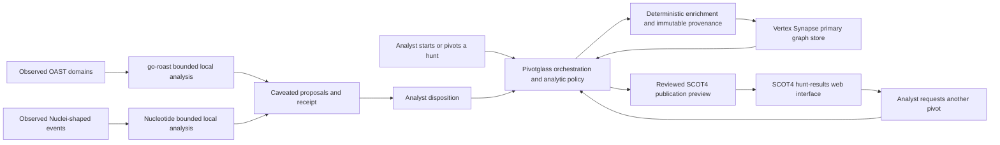

# External graph, publication, and analytic integrations

Pivotglass 0.9 uses bounded, read-only MCP clients for exploration. A remote
result is labelled `remote-preview`; it is not silently promoted to local
evidence, a relationship, or an analytic conclusion. SCOT publication is a
separate, explicitly approved REST workflow described below.

The same authority boundary applies to local analysis tools. go-roast and
Nucleotide output is labelled `external-derived-proposal`; it does not become
an observation, relationship, actor identity, attribution, or deployed control
without analyst review.

## Target architecture

Synapse and SCOT4 have different long-term roles:

- **Vertex Synapse becomes the primary graph database.** It persists normalized
  entities, provenance-bearing observations, typed relationships, time
  semantics, and the links among analytic records. Pivotglass continues to own
  normalization rules, evidence classes, confidence, contradiction handling,
  and analyst disposition. Synapse stores and queries that governed graph; it
  does not invent a second relationship or epistemic policy.
- **SCOT4 becomes the hunt-results web surface.** Pivotglass publishes a
  reviewed hunt-session projection into SCOT as connected events, entities,
  entries, tags, sources, and report artifacts. Analysts use SCOT to browse the
  result, follow relationships, and request further pivots. Those requests
  return to Pivotglass for validation, queueing, collection, and persistence in
  Synapse.



This is a staged migration, not a dual-write shortcut. Until the Synapse
parity, migration, recovery, and live round-trip gates pass, existing
Pivotglass workspaces remain authoritative. At cutover, one graph repository
contract selects Synapse as the persistence authority; a local database must
not continue as a competing source of truth.

SCOT publication is also staged. Read-only inspection comes first, followed by
a deterministic publication preview and explicit analyst approval. Successful
write-back must be read back and reconciled before Pivotglass reports that a
hunt session is published.

## Safety and authority

- Every Synapse Storm query runs only after validation. Interactive queries
  receive `opts.readonly=true`. An approved migration write receives
  `readonly=false` only together with the exact newly forked shadow-view ID;
  Pivotglass never writes a migration plan to the parent view.
- Storm pages, returned records, elapsed time, and response size are bounded.
  Pivotglass enforces the byte limit while streaming rather than after full
  buffering. Integration clients request identity encoding and reject encoded
  responses before decompression so expansion cannot bypass the memory budget.
  Pivotglass cancels the Synapse cursor when one of the other limits is reached.
- The SCOT4 MCP adapter exposes only object search, object detail, entries, and
  related entities. The separate REST publisher accepts only a freshly
  compiled plan, an exact short-lived human confirmation, and a configured
  publication endpoint.
- The inbound SCOT pivot endpoint authenticates the exact request bytes with a
  separate environment-owned HMAC secret and a five-minute timestamp window.
  Malformed, out-of-range, and unrepresentable timestamps fail with the same
  secret-safe authentication response.
  Authentication creates a pending inbox item only. It never starts enrichment
  or mutates the graph without a named local analyst's acceptance and rationale.
- Before its first SCOT mutation, the publisher atomically records a one-shot
  claim in the active workspace. A completed, in-progress, or uncertain claim
  blocks replay across process restarts. Every write is read back; Pivotglass
  reports success only after every field reconciles. Link identities include
  the complete connection assertion, and duplicate operation identities are
  rejected before approval or execution.
- Browser mutation routes accept only `application/json` from the configured
  same origin. This blocks cross-site form submission to approval-gated
  Synapse and SCOT commands. Native JSON clients without an `Origin` header
  remain supported; SCOT's separate exact-body HMAC endpoint retains its own
  authentication boundary.
- Receipts contain a digest of the request, timing, page and record counts,
  completion state, and the boundary that stopped an incomplete read. They do
  not contain the API key or raw Storm query.
- Every mapped record retains the remote system, type, ID, revision,
  permissions when supplied, retrieval time, and a stable conflict key.
- Local tools run as fixed argument arrays without a shell. Pivotglass removes
  API-key and application-specific environment variables, bounds run time,
  output bytes, input records, and event size, and emits a request-digest
  receipt for every successful result.
- OAST machine IDs and PIDs are correlation fragments. They are truncated,
  version-sensitive, and potentially spoofable, so Pivotglass never labels
  them as device or operator identity.
- Nucleotide requires the analyst to group events before fingerprinting.
  Unique means unique within the configured template corpus, and generated
  Snort, Suricata, Sigma, or YARA content is never deployed by Pivotglass.

## Configure

Add the endpoint settings to `~/.ap/config.toml`:

```toml
[integrations]
synapse_mcp_url = "https://synapse.example/api/v1/mcp"
scot_mcp_url = "https://scot.example/mcp"
scot_api_url = "https://scot.example/api/v1"
go_roast_executable = "/opt/pivotglass/bin/roast"
nucleotide_executable = "/opt/pivotglass/bin/nucleotide"
nucleotide_lookup_path = "/var/lib/pivotglass/nucleotide-lookup.json"
timeout_seconds = 20.0
max_pages = 10
max_records = 1000
max_local_output_bytes = 2000000
max_elapsed_seconds = 30.0
allow_insecure_http = false

[api_keys]
synapse = "..."
scot = "..."
```

The same values can be supplied without editing the file:

```text
AP_SYNAPSE_MCP_URL
AP_SYNAPSE_API_KEY
AP_SCOT_MCP_URL
AP_SCOT_API_URL
AP_SCOT_API_KEY
AP_SCOT_PIVOT_SECRET
AP_GO_ROAST_BIN
AP_NUCLEOTIDE_BIN
AP_NUCLEOTIDE_LOOKUP
```

Stored configuration takes precedence over environment variables except for
`AP_SCOT_PIVOT_SECRET`, which is intentionally environment-only and must be at
least 32 UTF-8 bytes. It is separate from the outbound SCOT API credential and
is never returned by ordinary configuration polling. Cleartext HTTP is limited
to loopback by default. Set `allow_insecure_http=true` only when a deliberately
isolated deployment requires it; HMAC authenticates and protects request
integrity but does not encrypt the indicator, requester, or reason. Put the
endpoint behind HTTPS for networked use.

Synapse's Cortex MCP endpoint is `/api/v1/mcp`. SCOT4 must have its MCP server
enabled, and its mounted path is normally `/mcp`. Use the complete endpoint
URL supplied by the administrator.

The local executables may be absolute paths or executable names on `PATH`.
Build the Nucleotide lookup separately from a reviewed, versioned Nuclei
template corpus and configure the resulting JSON file. Pivotglass deliberately
does not download template repositories or build/deploy detection rules in the
background. `integration nucleotide lookup-info` reports the corpus metadata
and digest used for every attribution.

## Integration commands

```text
integration status
integration proposals
integration review <proposal-id> <accept|reject> | <reason>
integration synapse shadow-preview
integration synapse model-contract
integration synapse model-deploy-plan
integration synapse model-deploy-execute <plan-digest> <backup-receipt-sha256> <approved-by> | <confirmation>
integration synapse model-deploy-receipt <plan-digest>
integration synapse migration-plan
integration synapse views
integration synapse shadow-execute <parent-view> <plan-digest> <backup-receipt-sha256> <approved-by> | <confirmation>
integration synapse shadow-receipt <plan-digest>
integration synapse status
integration synapse model <pattern>
integration synapse lookup <STIX-type> <indicator>
integration synapse query <Storm query>
integration scot status
integration scot publish-preview
integration scot publish-plan <owner>
integration scot publish-execute <owner> <plan-digest> <approved-by> | <confirmation>
integration scot publication-receipt <plan-digest>
integration scot pivot-preview <type> <id> <indicator> | <requester> | <reason>
integration scot pivot-inbox
integration scot pivot-accept <request-id> | <approved-by> | <reason>
integration scot pivot-reject <request-id> | <rejected-by> | <reason>
integration scot pivot-queue
integration scot get <object-type> <object-id>
integration scot search <object-type> [filters-json]
integration scot entries <object-type> <object-id> [plain|flaired|all]
integration scot entities <object-type> <object-id>
integration roast status
integration roast decode <OAST-domain>...
integration roast record <OAST-domain>...
integration roast analyze <OAST-domain>...
integration nucleotide status
integration nucleotide lookup-info
integration nucleotide lookup <URL>...
integration nucleotide lookup-strict <URL>...
integration nucleotide lookup-record <URL>...
integration nucleotide fingerprint-preview <actor-id> | <event-object-or-array-json>
integration nucleotide fingerprint-record <actor-id> | <event-object-or-array-json>
```

Preview and status commands are read-only. The `record` and `review` commands
change only the local analytic lifecycle after an explicit operator action;
they do not mutate source observations, the entity graph, Synapse, or SCOT.
Remote writes exist only behind the separate `synapse model-deploy-execute`,
`synapse shadow-execute`, and `scot publish-execute` approval gates.

`integration status` is local and makes no network request. A system-specific
`status` command opens an MCP session and lists the tools visible to that
credential. Every query is an explicit operator action; Pivotglass does not run
Storm or search SCOT in the background.

`synapse lookup` maps IPv4, IPv6, domain, URL, email, and MD5/SHA indicator
types to pinned Synapse forms. Values travel as Storm variables rather than
being interpolated into query text.

`synapse shadow-preview` compiles the active workspace's governed entity and
epistemic graph into a deterministic desired-state manifest. It uses native
Synapse forms for supported observables and the proposed `_pivotglass:record`
form for analytic records. Every edge retains its truth kind, rationale, and
provenance references. The manifest is not executable Storm and performs no
write. Exact parity compares node and edge content—not merely counts—before a
future backend cutover can be considered.

`synapse model-contract` exposes the pinned `_pivotglass:record` and
`_pivotglass:edge` persistent extended forms. The underscore namespace is
required by Synapse's supported extended-model API and avoids the deprecated
custom CoreModule deployment path. Companion record nodes keep
Pivotglass metadata off native Synapse observables; edge nodes retain source,
target, direction, truth class, rationale, and provenance. `synapse
migration-plan` compiles the shadow manifest into dependency-ordered,
bound-variable Storm writes and one exact readback per write. It requires model
digest parity, a backup, an isolated shadow view, Storm validation, analyst
approval, and readback while reporting `execution_enabled=false`.

`synapse model-deploy-plan` compiles dependency-ordered, bound-variable
`$lib.model.ext.addForm` and `addFormProp` calls plus exact readback without
connecting. Because the
extended model belongs to the whole Cortex rather than a view,
`model-deploy-execute` requires a current plan digest, an operator-created
backup receipt, a bounded human identity, and the exact 15-minute confirmation
phrase. It validates the Storm, records a one-shot claim before mutation,
performs no change when the exact model is already installed, and otherwise
requires both exact extended-model readback and runtime form/property
visibility. A failed or interrupted mutation is recorded as outcome uncertain
and cannot be replayed silently. Use `model-deploy-receipt` to inspect it.

`synapse views` lists readable views and identifies the credential's effective
default; Pivotglass never guesses the parent view. `synapse shadow-execute`
recompiles the active workspace, rejects a stale plan digest, requires the
SHA-256 of an operator-created backup receipt, and accepts only the exact
15-minute confirmation phrase bound to the parent view. It verifies the
required MCP tools and deployed `_pivotglass:record`/`_pivotglass:edge` model,
then forks the named parent. Every validated write and readback carries that
new fork ID in Storm `opts.view`. Exact node definitions and custom properties
must reconcile. The successful fork remains unmerged for inspection; no
Pivotglass command currently merges it. A failed load asks Synapse to remove
the fork view and records that its underlying layer deletion was not verified.
Either result is journaled and cannot be replayed silently. Use `synapse shadow-receipt <plan-digest>` to
inspect that record.

Maintainers can validate the contract and generated Storm against a disposable
Synapse installation with:

```text
python scripts/validate_synapse_contract.py
```

The v2 extended-model contract (`f3731ed95c83e8268ef183b14e1d830ccefa1aeeebd156d74faf9c5a00ab981d`)
and eight seeded write/readback operations were exercised successfully on
2026-08-24 against a disposable Cortex from upstream Synapse 2.250.0 commit
`513524166d57d086cf619be715fc9ded6a7c7a54`. This validates the deployment and
migration Storm against a real Cortex; it is not a production cutover receipt.

`scot publish-preview` compiles that same graph snapshot into a deterministic
SCOT event, associated entities and analytic entries, and a relationship index.
It always reports `approval_required=true` and `published=false`. The preview
does not require a SCOT connection because it is a local transformation of
authoritative workspace data.

`scot publish-plan <owner>` takes that manifest one step farther without
connecting to SCOT. It compiles the preview into the exact SCOT4 event, entity,
entry, tag, and typed-link REST operations, orders their dependencies, uses
explicit result-ID placeholders, and adds a required readback after every
mutation. The plan reports `approval_required=true`,
`execution_enabled=false`, and `readback_required=true`: it is a review
artifact, not permission to publish. Entry text is HTML-escaped before it
enters the request body.

To publish, inspect the complete plan, retain its SHA-256 digest, and use the
exact confirmation shown by the plan:

```text
integration scot publish-execute analyst <plan-digest> analyst@example.org | APPROVE SCOT PUBLICATION <first-16-digest-characters>
```

Pivotglass recompiles the active workspace before execution and rejects a
stale digest. Approval expires after 15 minutes. Mutations are never retried.
The schema-v6 workspace journal claims the plan before the first request and
stores only sanitized response digests, remote IDs, status codes, and the
reconciled receipt. If transport or readback fails after the claim, its state
becomes `outcome_uncertain`; the same plan cannot run again until an analyst
reconciles SCOT manually. Inspect any claim with `scot
publication-receipt <plan-digest>`.

`scot pivot-preview` validates an indicator, SCOT parent reference, requester,
and reason. Its disposition remains `preview`; it does not enqueue enrichment.
This prevents content displayed in SCOT from becoming an instruction merely by
arriving through the integration.

SCOT can submit that validated JSON envelope to
`POST /api/integrations/scot/pivot-request` with `Content-Type:
application/json` and these headers:

```text
X-Pivotglass-Key-Id: <1-64 safe identifier characters>
X-Pivotglass-Timestamp: <current Unix seconds>
X-Pivotglass-Nonce: <16-128 base64url-safe characters>
X-Pivotglass-Signature: sha256=<lowercase HMAC-SHA256 hex>
```

The HMAC input is the UTF-8 prefix below followed immediately by the exact raw
JSON body bytes. The sender and Pivotglass must use the same body serialization.

```text
pivotglass-scot-pivot-v1\n<key-id>\n<timestamp>\n<nonce>\n<body-bytes>
```

Pivotglass rejects malformed, altered, unrepresentable, or
more-than-five-minute-skewed requests.
It stores hashes of the body and nonce, not the shared secret, signature, or raw
nonce. A valid retry returns the existing inbox item, so transport retries do
not create duplicate work.

`scot pivot-inbox` lists authenticated requests. `scot pivot-accept
<request-id> | <approved-by> | <reason>` atomically records the human decision
and creates the durable enrichment item. `scot pivot-reject <request-id> |
<rejected-by> | <reason>` records the rejection and creates no work. Repeating
an acceptance cannot start a second investigation.

`scot pivot-enqueue <type> <id> <indicator> | <requester> | <reason> |
<approved-by>` is the separate local approval action. It records an idempotent,
provenance-bearing collection requirement in the scientific lifecycle. In
Pivotglass web, that durable item is handed to the ordinary deterministic
enrichment planner and its queued, running, and terminal states are written
back to the same record. `scot pivot-queue` lists the durable queue. Repeating
the same SCOT request cannot start a second investigation after its queue item
has advanced.

`roast decode` uses go-roast's documented JSON interface. The preview preserves
timestamp, campaign, counter, classification, machine fragment, PID fragment,
and tool reasoning. It proposes typed `encodes-*` connections with explicit
caveats and provenance; it does not mutate the graph. `roast analyze` preserves
go-roast's campaign analysis as a sourced preview and explicitly rejects
machine or timezone correlation as identity proof.

`roast record` performs the same bounded decode and records each proposed
relationship in the scientific-investigation lifecycle. Repeating the same
result is idempotent. Every item begins with a pending analyst disposition,
retains the tool receipt and caveats, and remains an external-derived proposal
rather than observed evidence. If the decoded domain exactly matches one or
more immutable workspace observations, the proposal records those observation
IDs and source-dependence groups. The combined epistemic graph then shows an
explicit `derived-from` link; that link documents provenance and does not
validate the decoded relationship.

`roast correlations` reviews persisted go-roast proposals without running the
external tool. It groups domains sharing a decoded fragment, reports linked
observation and source-group counts, and flags one domain/relationship pair
that has incompatible targets as a decoder-output conflict. Source-group
diversity does not automatically establish independence or confidence, and a
decoder-output conflict is a prompt for analyst review rather than a fabricated
contradiction in observed evidence.

`nucleotide lookup` uses the configured lookup JSON and preserves `UNIQUE`,
`AMBIGUOUS`, and `NO_MATCH`. `fingerprint-preview` accepts one event object or
an array in the documented JSONL event shape; `uri` or `url` is required. It
shows Nucleotide's supporting signals, contradictions, inferred CLI options,
template preference, structural hash, and unmatched Nuclei-shaped request count. The `actor-id`
names an analyst-grouped batch; it is not an attribution claim.

`nucleotide lookup-record` and `fingerprint-record` place those derived results
under the same lifecycle gate. `integration proposals` lists all pending and
reviewed items. `integration review <proposal-id> <accept|reject> | <reason>`
requires a human rationale and retains a review history. Acceptance means the
analyst accepts the proposal as analytic work; it does not reclassify it as a
source observation, prove actor identity, or deploy generated controls.

When a lookup URL exactly matches an immutable workspace observation,
`lookup-record` attaches that observation and source-dependence metadata to the
proposal. The epistemic graph shows the explicit `derived-from` citation. The
citation proves which collected record was analyzed; it does not prove that
Nuclei generated the request or that a unique-within-corpus match is unique in
the wider world.

An accepted proposal can then be promoted with `integration materialize
<proposal-id> | <rationale>`. This separate human action creates a typed,
inferred assertion with the original receipt, caveats, proposal lineage, and
review history. It is idempotent and creates neither an evidence observation
nor an observed entity edge. The investigation graph displays the assertion
and its `materialized-from` link to the retained external proposal.

`nucleotide fingerprint-history <actor-id>` lists the persisted windows for an
analyst-grouped batch. `nucleotide fingerprint-compare <left-proposal-id>
<right-proposal-id>` passes the two exact stored artifacts to Nucleotide's
published field-by-field comparison command. The result exposes structural-hash
and field drift, both lookup-corpus digests, and a warning when those corpora
differ. It creates no Pivotglass confidence assessment and makes no actor
identity claim.

Example incremental SCOT preview:

```text
integration scot search incident {"modified":"2026-08-01"}
```

The accepted SCOT filter grammar is owned by the connected SCOT4 deployment.
Pivotglass passes the JSON object to SCOT and preserves the resulting revision
metadata. It does not infer that a returned object is current when the read was
stopped by a budget.

## Deliberately unfinished

The current slices establish transport, repository snapshots, Synapse desired
state, parity, persistent extended model, approval-gated model deployment, and
approval-gated isolated shadow migration; SCOT publication
previews, exact write plans, one-shot approval-gated execution, durable
receipts, mandatory readback reconciliation, and pivot validation; go-roast
OAST graph proposals; Nucleotide lookup/fingerprint previews; governed
external-analysis proposal disposition; and protocol fixtures.
Before either integration is release-complete, it still needs:

- disposable live-system round-trip tests;
- live backup, recovery, reviewed shadow merge, and cutover gates;
- live Synapse relationship/time/provenance round-trip fixtures;
- live disposable-SCOT readback, lossless reconciliation, and conflict
  disposition beyond the protocol fixtures;
- a disposable live-SCOT exercise of the authenticated pivot endpoint and its
  SCOT-side UI action; the receiving contract, local review inbox, acceptance,
  rejection, and idempotent execution path are implemented and locally tested.

Unreviewed graph mutations and unapproved SCOT publication remain out of scope.
