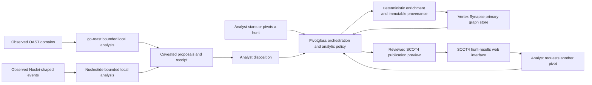

# External graph, publication, and analytic integrations

Pivotglass 0.9 begins both integrations as bounded, read-only MCP clients. A
remote result is labelled `remote-preview`; it is not silently promoted to
local evidence, a relationship, or an analytic conclusion.

The same authority boundary applies to local analysis tools. go-roast and
Nucleotide output is labelled `external-derived-proposal`; it does not become
an observation, relationship, actor identity, attribution, or deployed control
without analyst review.

## Target architecture

Synapse and SCOT4 have different long-term roles:

- **Vertex Synapse becomes the primary graph database.** It persists normalized
  entities, provenance-bearing observations, typed relationships, time
  semantics, and the links among analytic records. Pivotglass continues to own
  normalization rules, evidence classes, confidence, contradiction handling,
  and analyst disposition. Synapse stores and queries that governed graph; it
  does not invent a second relationship or epistemic policy.
- **SCOT4 becomes the hunt-results web surface.** Pivotglass publishes a
  reviewed hunt-session projection into SCOT as connected events, entities,
  entries, tags, sources, and report artifacts. Analysts use SCOT to browse the
  result, follow relationships, and request further pivots. Those requests
  return to Pivotglass for validation, queueing, collection, and persistence in
  Synapse.



This is a staged migration, not a dual-write shortcut. Until the Synapse
parity, migration, recovery, and live round-trip gates pass, existing
Pivotglass workspaces remain authoritative. At cutover, one graph repository
contract selects Synapse as the persistence authority; a local database must
not continue as a competing source of truth.

SCOT publication is also staged. Read-only inspection comes first, followed by
a deterministic publication preview and explicit analyst approval. Successful
write-back must be read back and reconciled before Pivotglass reports that a
hunt session is published.

## Safety and authority

- Synapse Storm runs only after validation and always receives
  `opts.readonly=true`.
- Storm pages, returned records, elapsed time, and response size are bounded.
  Pivotglass cancels the Synapse cursor when one of those limits is reached.
- The SCOT4 adapter exposes object search, object detail, entries, and related
  entities. It exposes no remote write operation.
- Receipts contain a digest of the request, timing, page and record counts,
  completion state, and the boundary that stopped an incomplete read. They do
  not contain the API key or raw Storm query.
- Every mapped record retains the remote system, type, ID, revision,
  permissions when supplied, retrieval time, and a stable conflict key.
- Local tools run as fixed argument arrays without a shell. Pivotglass removes
  API-key and application-specific environment variables, bounds run time,
  output bytes, input records, and event size, and emits a request-digest
  receipt for every successful result.
- OAST machine IDs and PIDs are correlation fragments. They are truncated,
  version-sensitive, and potentially spoofable, so Pivotglass never labels
  them as device or operator identity.
- Nucleotide requires the analyst to group events before fingerprinting.
  Unique means unique within the configured template corpus, and generated
  Snort, Suricata, Sigma, or YARA content is never deployed by Pivotglass.

## Configure

Add the endpoint settings to `~/.ap/config.toml`:

```toml
[integrations]
synapse_mcp_url = "https://synapse.example/api/v1/mcp"
scot_mcp_url = "https://scot.example/mcp"
go_roast_executable = "/opt/pivotglass/bin/roast"
nucleotide_executable = "/opt/pivotglass/bin/nucleotide"
nucleotide_lookup_path = "/var/lib/pivotglass/nucleotide-lookup.json"
timeout_seconds = 20.0
max_pages = 10
max_records = 1000
max_local_output_bytes = 2000000
max_elapsed_seconds = 30.0
allow_insecure_http = false

[api_keys]
synapse = "..."
scot = "..."
```

The same values can be supplied without editing the file:

```text
AP_SYNAPSE_MCP_URL
AP_SYNAPSE_API_KEY
AP_SCOT_MCP_URL
AP_SCOT_API_KEY
AP_GO_ROAST_BIN
AP_NUCLEOTIDE_BIN
AP_NUCLEOTIDE_LOOKUP
```

Stored configuration takes precedence over environment variables. Cleartext
HTTP is limited to loopback by default. Set `allow_insecure_http=true` only
when a deliberately isolated deployment requires it; the traffic, including
credentials, is otherwise visible on that network.

Synapse's Cortex MCP endpoint is `/api/v1/mcp`. SCOT4 must have its MCP server
enabled, and its mounted path is normally `/mcp`. Use the complete endpoint
URL supplied by the administrator.

The local executables may be absolute paths or executable names on `PATH`.
Build the Nucleotide lookup separately from a reviewed, versioned Nuclei
template corpus and configure the resulting JSON file. Pivotglass deliberately
does not download template repositories or build/deploy detection rules in the
background. `integration nucleotide lookup-info` reports the corpus metadata
and digest used for every attribution.

## Read-only commands

```text
integration status
integration synapse shadow-preview
integration synapse status
integration synapse model <pattern>
integration synapse lookup <STIX-type> <indicator>
integration synapse query <Storm query>
integration scot status
integration scot publish-preview
integration scot publish-plan <owner>
integration scot pivot-preview <type> <id> <indicator> | <requester> | <reason>
integration scot get <object-type> <object-id>
integration scot search <object-type> [filters-json]
integration scot entries <object-type> <object-id> [plain|flaired|all]
integration scot entities <object-type> <object-id>
integration roast status
integration roast decode <OAST-domain>...
integration roast analyze <OAST-domain>...
integration nucleotide status
integration nucleotide lookup-info
integration nucleotide lookup <URL>...
integration nucleotide lookup-strict <URL>...
integration nucleotide fingerprint-preview <actor-id> | <event-object-or-array-json>
```

`integration status` is local and makes no network request. A system-specific
`status` command opens an MCP session and lists the tools visible to that
credential. Every query is an explicit operator action; Pivotglass does not run
Storm or search SCOT in the background.

`synapse lookup` maps IPv4, IPv6, domain, URL, email, and MD5/SHA indicator
types to pinned Synapse forms. Values travel as Storm variables rather than
being interpolated into query text.

`synapse shadow-preview` compiles the active workspace's governed entity and
epistemic graph into a deterministic desired-state manifest. It uses native
Synapse forms for supported observables and the proposed `pivotglass:record`
form for analytic records. Every edge retains its truth kind, rationale, and
provenance references. The manifest is not executable Storm and performs no
write. Exact parity compares node and edge content—not merely counts—before a
future backend cutover can be considered.

`scot publish-preview` compiles that same graph snapshot into a deterministic
SCOT event, associated entities and analytic entries, and a relationship index.
It always reports `approval_required=true` and `published=false`. The preview
does not require a SCOT connection because it is a local transformation of
authoritative workspace data.

`scot publish-plan <owner>` takes that manifest one step farther without
connecting to SCOT. It compiles the preview into the exact SCOT4 event, entity,
entry, tag, and typed-link REST operations, orders their dependencies, uses
explicit result-ID placeholders, and adds a required readback after every
mutation. The plan reports `approval_required=true`,
`execution_enabled=false`, and `readback_required=true`: it is a review
artifact, not permission to publish. Entry text is HTML-escaped before it
enters the request body.

`scot pivot-preview` validates an indicator, SCOT parent reference, requester,
and reason. Its disposition remains `preview`; it does not enqueue enrichment.
This prevents content displayed in SCOT from becoming an instruction merely by
arriving through the integration.

`roast decode` uses go-roast's documented JSON interface. The preview preserves
timestamp, campaign, counter, classification, machine fragment, PID fragment,
and tool reasoning. It proposes typed `encodes-*` connections with explicit
caveats and provenance; it does not mutate the graph. `roast analyze` preserves
go-roast's campaign analysis as a sourced preview and explicitly rejects
machine or timezone correlation as identity proof.

`nucleotide lookup` uses the configured lookup JSON and preserves `UNIQUE`,
`AMBIGUOUS`, and `NO_MATCH`. `fingerprint-preview` accepts one event object or
an array in the documented JSONL event shape; `uri` or `url` is required. It
shows Nucleotide's supporting signals, contradictions, inferred CLI options,
template preference, structural hash, and unmatched Nuclei-shaped request count. The `actor-id`
names an analyst-grouped batch; it is not an attribution claim.

Example incremental SCOT preview:

```text
integration scot search incident {"modified":"2026-08-01"}
```

The accepted SCOT filter grammar is owned by the connected SCOT4 deployment.
Pivotglass passes the JSON object to SCOT and preserves the resulting revision
metadata. It does not infer that a returned object is current when the read was
stopped by a budget.

## Deliberately unfinished

The current slices establish transport, repository snapshots, Synapse desired
state and parity contracts, SCOT publication previews and exact review-only
write plans, pivot validation,
receipts, go-roast OAST graph proposals, Nucleotide lookup/fingerprint
previews, and protocol fixtures.
Before either integration is release-complete, it still needs:

- disposable live-system round-trip tests;
- a deployed and versioned Synapse model package for the proposed custom forms;
- backup-first migration, shadow comparison, recovery, and cutover gates;
- live Synapse relationship/time/provenance round-trip fixtures;
- an approval-gated SCOT executor with durable per-operation receipts;
- live SCOT readback, lossless reconciliation, and conflict disposition;
- SCOT-originated pivot requests routed through Pivotglass validation and the
  enrichment queue.

Unreviewed graph mutations and unapproved SCOT publication remain out of scope.
