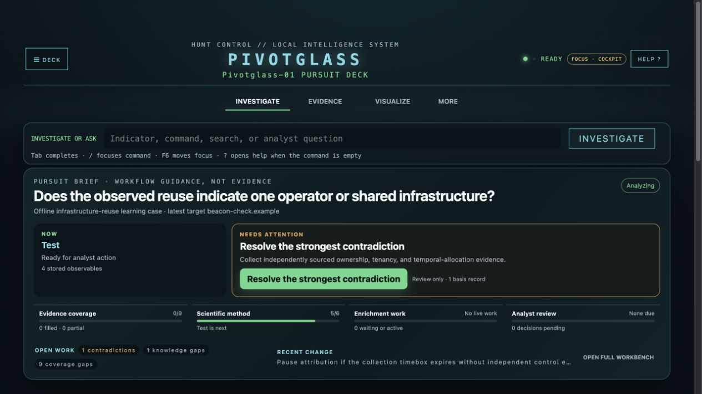

# Pivotglass Quick Start

Threat investigations often begin with disconnected reports, logs, and indicators.
A useful judgment needs a question, traceable evidence, and a way to test
competing explanations. Pivotglass keeps each result with its
source and time, connects only what the evidence supports, and leaves
unanswered questions visible.

This guide takes you from installation through a complete offline
investigation: question, evidence, competing explanations, review, and report.
Provider and model configuration comes after the practice case; the case needs
neither. Keep shell commands in your terminal and workspace/analysis commands
in the Pivotglass command field.

Prefer a calmer display? Open **Help → Reading & attention** for larger text
and **Quiet workspace**. Dimming is optional and off by default. Help also has
direct routes to create a report or choose an export format. These presentation
choices do not change your evidence or suppress error alerts.

## Watch with captions

[Watch the current narrated tour](media/pivotglass-guided-demo-v0.9.9.mp4),
[read the transcript](media/pivotglass-guided-demo-transcript-v0.9.9.md), or
[download its WebVTT captions](media/pivotglass-guided-demo-v0.9.9.vtt).
It uses edited actual UI captures from an isolated synthetic case, not a
continuous recording or a live provider investigation.

The repository includes an [HTML player with captions on by default](media/pivotglass-guided-demo-v0.9.9.html).
GitHub displays HTML as source; to use the player from a cloned checkout, serve
only the public media folder on loopback:

```bash
uv run python -m http.server 8877 --bind 127.0.0.1 --directory docs/media
```

Open `http://127.0.0.1:8877/pivotglass-guided-demo-v0.9.9.html`. Use the player's
caption control to change caption display, or use the adjacent transcript.
The basic Python server supports sequential playback; reliable chapter seeking
requires a server with HTTP byte-range support. For offline seeking, open the
MP4 and its same-named VTT file in a media player that supports external captions.
Stop this separate media server with Ctrl+C when finished. The steps below are
the complete practice path; you can follow them without watching the video.

## 1. Install Pivotglass

You need Python 3.12 or newer, Git, and
[uv](https://docs.astral.sh/uv/). The source tag plus its committed lockfile is
the only supported pre-1.0 installation because it reproduces the dependency
set used for release qualification.

```bash
git clone --branch v0.9.9 --depth 1 https://github.com/jarocki/pivotglass.git
cd pivotglass
uv sync --extra agent --frozen
uv run pivotglass --version
```

The final command should report:

```text
pivotglass 0.9.9
```

The release contains the built browser interface. Node.js 20.9 or newer is
needed only when changing or rebuilding that interface.

The published wheel is verified as a package and packaged-web artifact, but its
standard Python dependency metadata contains compatible version ranges. A
standalone installer may therefore select dependencies newer than the exact
release lock. That path is useful for compatibility testing, but it is not the
supported reproducible installation. The release SBOM describes the qualified
locked source environment.

### Update or remove Pivotglass

From a clean source checkout, update to this release using its explicit tag and
recreate the locked environment:

```bash
git fetch --tags origin
git checkout v0.9.9
uv sync --extra agent --frozen
uv run pivotglass --version
```

If the checkout contains local changes, preserve them and install the release
in a new directory instead of forcing a checkout. Remove the application and
its `pivotglass` command from this environment with:

```bash
uv pip uninstall pivotglass
```

The product, command, Python distribution, and import package now use
`pivotglass`. User-owned configuration and workspaces live under
`~/.pivotglass/`. Uninstalling the package does not remove those files. Back
up or remove investigation data separately and deliberately. Before upgrading
an existing installation, follow [Workspace migration and recovery](WORKSPACE_MIGRATIONS.md)
and preserve a backup; a successful version check alone does not establish
that a valuable workspace has migrated correctly.

### Preserve data from an earlier installation

The v0.9.8 name change does not implicitly select an older data directory.
Stop all Pivotglass processes using your old directory and back it up. Before
starting a release that uses the new names, copy that directory into a **new, absent** destination with:

```bash
uv run pivotglass migrate-home --from /absolute/path/to/previous-data --confirm-stopped
```

The command copies into `~/.pivotglass/`, preserves the source, refuses an
existing destination or symbolic links, and publishes the destination only
when the copy has completed. To use a different destination, add
`--to /absolute/path/to/new-data`; this changes only where the copy is written,
not the default application directory. This is a local data copy, separate from
workspace schema migration. Review the receipt and follow the
[workspace validation and recovery procedure](WORKSPACE_MIGRATIONS.md)
before using valuable investigation data. Update scripts, environment variables,
and launchers to the new `pivotglass` command and `PIVOTGLASS_*` names.

## 2. Start the browser interface

```bash
pivotglass
```

Use `uv run pivotglass`. Pivotglass opens in the browser. If it does not open
automatically, visit:

```text
http://127.0.0.1:8765
```

The server listens only on the local computer by default.

Other interfaces remain available:

```text
pivotglass tui      Full-screen terminal interface
pivotglass chat     Alias for the terminal interface
pivotglass basic    Direct module-control console
pivotglass repl     Alias for the direct console
```

## 3. Create a learning workspace

No account, API key, model, or network service is required for the first case.
In the Pivotglass command field, enter:

```text
workspace learn quickstart
```

Use an unused name; choose `quickstart-2` if `quickstart` already exists.
The command creates and activates a real, persistent investigation populated with
reserved synthetic data. Its receipt reports zero model and network requests.
The case includes source hashes and handling markings, four connected entities,
two competing hypotheses, a high-materiality contradiction, formal confidence,
separate likelihood, a knowledge gap, a collection requirement, a prediction,
and a stop condition.

Inspect the scientific workflow:

```text
analysis lifecycle
analysis contradictions
analysis priorities
```

**Checkpoint:** `status` names your synthetic workspace and `analysis show`
shows the question and both hypotheses. Keep the fixture indicators offline.

The fixture intentionally does not resolve the contradiction. Topology can be
consistent with common control or shared infrastructure, so the open gap asks
for contemporaneous ownership or tenancy evidence. This is visible uncertainty,
not a broken tutorial.

For an exact evidence, graph, report, export, restart, and recovery walkthrough,
continue with the [offline learning investigation](LEARNING_WORKSPACE.md).

In a real workspace, submitting the first indicator starts the applicable enrichment work. The
activity feed shows each job moving through planned, queued, running, and a
terminal state such as succeeded, empty, failed, skipped, or canceled. These
states describe the enrichment job—not whether the indicator is malicious.

**Enrichment Activity** keeps recent indicators as rows and enrichment sources
as columns, newest activity first. Each large cell contains a three-channel
8-bit LED. Green `[0,255,0]` means the enrichment completed, black `[0,0,0]`
means no result is mapped, and gray `[128,128,128]` marks partial coverage.
Symbols and text repeat every status; color is never the only cue.

Run `challenges` to see source-grounded goals for the current pursuit and
`badges` to review earned milestones. Pivotglass includes 40 graduated badges;
their shapes identify the achievement family and their labeled color tier marks
common, uncommon, rare, epic, or legendary awards.

For real research, create a separate workspace and submit only
indicators you are authorized to send to the enabled services.

> An indicator is not the answer. It is the first node.


### Frame your question before collecting more

In a separate workspace for your own case, choose **BUILD INVESTIGATIVE
QUESTIONS · Q&A** or **Help → Build Investigative Questions**. Novice guidance
asks about your sources, the event, its possible origin, affected scope, the
decision you need to support, and alternatives.

Answer one prompt at a time; use **I DON'T KNOW YET** for a knowledge gap.
Review the three suggested questions, edit them into bounded, testable
questions, and choose **SAVE THIS QUESTION** only for the ones you need.
Saving writes a question to the notebook; it does not validate your reported
context or run enrichment. Drafts and reflections stay in this browser,
scoped by workspace. They are separate from saved questions and exports.

Try: “Between 10:00 and 11:00 UTC, did the proxy connections from this host
reflect expected administration or unauthorized activity, and what evidence
would distinguish them?” This is an example of question structure, not a
finding about your workspace. See the
[guided first investigation](USER_GUIDE.md#walkthrough-from-reported-context-to-a-question)
for a complete exercise.



## 4. Read the Investigation Constellation

Open **Visualize**, then choose **Investigation Constellation** from **Choose an
analyst question**.

Each row is a stored indicator. Each column is one of the nine Dossier
dimensions. The newest indicators appear first. Filter or sort by value, type,
completeness, first seen, last seen, or direct relationship to another
indicator.

Select an indicator to open its evidence. Select a cell to see why that
dimension is filled, partial, empty, or deferred. The overall mapped value is a
navigation aid, not confidence or a verdict.

The Constellation keeps all nine dimensions aligned beside each indicator:
green check = **Coverage met**, amber half-circle = **Some evidence**, open
circle = **No evidence**, dash = **No automated path**. Coverage is not
confidence or safety. Source-reported country flags describe infrastructure
location, never attacker origin. Shape repeats color, and hover,
keyboard focus, and selection expose the complete status and evidence count.
Tab enters the matrix once. Use arrow keys to move between pegs and Enter or
Space to pin the focused explanation below the matrix. Select **Open evidence
& provenance** to inspect the records behind that indicator.

> A blank cell is not missing interface. It is visible uncertainty.

### Add a report or indicator list

Open **Investigate**, expand **Add indicators & reports**, and choose a supported
local file. Pivotglass previews text, Markdown, HTML, CSV, JSON, JSONL, and email;
PDF input is recognized but its text and images are not yet extracted. Preview
is local, temporary, and bounded to 10 MiB. It shows what was parsed, skipped,
truncated, or rejected. Preview alone stores nothing and creates no evidence,
entity, or relationship.

JSON recognition uses content, extension, and structured MIME types rather than
trusting a browser label alone. It supports UTF-8/16/32 signatures and strict
JSONL records found in a `.json` file. Duplicate keys and malformed records are
shown only as bounded raw text with an explicit warning; they are not silently
repaired. Non-finite values and excessive nesting fail closed.

Expand **Entity candidates** to inspect deterministic text matches. Each match
shows the raw and normalized value, entity type, line and column, character and
UTF-8 byte span, and extraction rule/version. Review up to 2,000 bounded candidates
in pages of 50 using **Previous** and **Next**. **Select this page** adds only the
current page to your selection; selections on other pages remain checked.
They remain temporary candidates,
not admitted evidence or graph nodes.

After reviewing the digest, parser receipt, and candidates, check only the
entities you intend to add. Choose **Ingest source + add entities** to bind the
selection to the source SHA-256, exact parser span, normalized value, and
extractor rule, store the source occurrence, and admit those selected entities
through the workspace evidence authority. Choose **Ingest source only** when the
report belongs in the library but none of its candidate strings should become
entities. Neither path assigns maliciousness, validates the report's claims,
creates a threat relationship, or attributes an actor.

If the source receipt appears but entity admission is interrupted, choose
**Retry entity admission**. The retry is idempotent against the stored source:
it does not upload a second copy or duplicate an already admitted entity.

Open **Visualize → Provenance History** to see the recorded path
of document, indicator, and entity navigation. This trail explains how the
analyst arrived at the current position; it is a workflow record, not evidence
that two threat entities are related.

## 5. Pivot to related evidence

When enrichment discovers another indicator:

1. Open its evidence details.
2. Review its source, normalized fields, collection history, and relationships.
3. Choose **+ QUEUE** if it is worth investigating.
4. Choose **RUN NEXT** for one queued indicator or **RUN ALL** to process the
   queue in order.

The first indicator entered in the command field starts immediately. **RUN
NEXT** and **RUN ALL** apply to later indicators you explicitly queue.

Most integrations query intelligence already held by a provider. Pivotglass
does not issue a direct DNS query from the operator host. URLScan is different:
it can submit a URL or domain to an external browser-scanning service. Review
the enabled service before sending private or embargoed indicators.

## 6. Explore the relationship graph

In **VISUAL ANALYSIS**, choose **Evidence relationships**.

You can search by indicator or type, drag nodes, pan and zoom, select a node to
highlight its visible neighbors, and choose **OPEN EVIDENCE** to inspect its
provenance. Double-click a connected node, or use **COLLAPSE DIRECT
CONNECTIONS**, to hide its immediate branches temporarily. Expand it again or
choose **SHOW ALL CONNECTIONS** to restore the complete view. Collapsed nodes
remain present in the accessible inventory and exact-data export.

Use **UNDO VIEW** and **REDO VIEW** for layout changes, or press
`Command/Control+Z` and `Shift+Command/Control+Z` while focus is in the graph.
The bounded history covers node movement, pan/zoom, pins, display labels, and
collapsed connections. It never reverses evidence or analyst judgments.

Edges represent stored or explicitly labeled conservative relationships.
Moving nodes changes only the layout. If no supported edge exists, Pivotglass
shows unconnected indicators rather than implying a relationship from visual
proximity.

Enter a layout name and choose **SAVE VIEW** to keep the arrangement through
refreshes and restarts. Saved views travel with workspace export and merge.
Loading a view reports graph changes; it never restores old evidence or edges.

Select two nodes to add an annotated analyst judgment. Use **Review analyst
relations** to revise or retract one later. Pivotglass keeps the old assertion
and the stated correction reason in the investigation history; only active
judgments appear as manual graph edges.

> The graph is useful because it refuses to connect what the evidence does not.

The `graph` command opens the deterministic graph summary:

```text
graph
```

Export the combined entity and analytic graph, or one explicit layer:

```text
graph export gexf all
graph export json epistemic
graph export csv bridge
```

GEXF opens in Gephi. JSON and CSV retain each edge's truth class, provenance,
rationale, and direction. The older `export stix` remains the standards-based
entity/evidence exchange; Pivotglass does not disguise analytic notebook
records as observed STIX objects.


## 7. Test the explanations before deciding

The learning case includes a common-control hypothesis and a
shared-infrastructure alternative. A connected graph fits both, so topology
alone cannot distinguish them. Enter:

```text
analysis show
analysis contradictions
analysis priorities
```

Read the recorded question, both explanations, the low confidence basis, and
the separately stated likelihood. Locate the unresolved ownership or tenancy
gap. Ask what source could establish **who controlled the address during the
relevant interval**, and whether that collection is feasible and authorized.
More reputation results may add data without answering that question.

For a local practice action, record an exposed assumption:

```text
analysis assumption Connected infrastructure implies exclusive common control.
```

This writes an analyst-authored assumption, not an observed fact. Inspect
`analysis show` for the new record. The
[worked example](analysis/WORKED_EXAMPLE.md#6-practice-a-key-assumptions-check)
then shows how to challenge it with a Key Assumptions Check, preserve the
method result, and review it explicitly. Follow the returned IDs rather than
copying placeholder IDs. The application checks protocol fields; the analyst
judges whether the argument and evidence are sound.

To make an evidence stance explicit, find the real IDs in `analysis show` and
use the browser command field or full-screen terminal:

```text
analysis link observation <observation-id> hypothesis <hypothesis-id> supports | Explain what this record supports and why it does not eliminate the alternative.
```

This records your interpretation with a rationale. It does not accept the
hypothesis or collect anything. Check the receipt and the
[comparison matrix](USER_GUIDE.md#record-how-evidence-bears-on-an-explanation);
an unassessed cell still means no stance was recorded.


**Checkpoint:** explain why the two hypotheses remain plausible, name one
finding that would discriminate between them, and distinguish coverage,
likelihood, and confidence. An accurate unresolved result is useful if it
identifies what should be collected next.

## 8. Report and export

Generate the current Dossier report:

```text
report generate
```

Confirm the workspace name and review the question, evidence basis,
alternatives, confidence, and remaining gap in the report. The report is built
from the active workspace. Use **SAVE MARKDOWN** in the report dialog to
download the exact report as a `.md` file, or **PRINT / SAVE PDF** to print it
or save a PDF. Review handling and redaction before sharing either format.

Download investigation data with:

```text
export json
export csv
export stix
export gexf
```

Use STIX for structured exchange and GEXF for tools such as Gephi. Every Visual
Analysis view also offers **EXPORT EXACT DATA**, which downloads the rows or
nodes and edges used for that view.

In **Visual Analysis**, use the force-directed graph to inspect evidence-backed
relationships. Use **Indicator coverage similarity** to compare which
investigations have similar Dossier coverage. The latter is a PCA projection,
not a relationship or attribution graph; open its exact-data table to see the
included dimensions and explained variance.

Hold Shift, Command, or Control while selecting graph nodes to assemble a
temporary working set. You can pin or unpin the selected group without changing
evidence. Saved views keep layout, labels, filter, viewport, and pins, but never
the temporary selection.

When exactly two nodes are selected, you may add an annotated directional
relation. The result is visibly marked as an analyst judgment and does not
become observed evidence. Use it to preserve a working hypothesis about a
connection, not to replace collection or corroboration.

After recording competing hypotheses and linking evidence with `analysis`,
open **Competing hypotheses matrix** to compare the same evidence across every
explanation. A **not assessed** cell is a visible gap, not neutral evidence;
use the exact-data table to review the recorded rationale.

Open **Investigation hierarchy** to see how the notebook divides into
questions, hypotheses, signposts, collection requirements, and other workflow
items. Expand or collapse branches with the keyboard or pointer. The hierarchy
shows membership only—not evidence support or causality.

Open **Likelihood and confidence** after recording an `analysis likelihood`
assessment. The bar shows the probability interval associated with the chosen
likelihood term. Confidence remains a separate labeled judgment with its own
rationale; it is not another position on the probability scale.

Before sharing any export, remember that it can contain raw indicators and
source-derived information.

## 9. Configure intelligence and AI services

Open **MORE**, then **MODEL & API CONFIGURATION** in Pivotglass.

### Intelligence services

For each service you intend to use:

1. Find the service under **INTELLIGENCE APIS**.
2. Enter the required credential fields.
3. Choose **SAVE + TEST**.
4. Leave the service disabled if you do not want Pivotglass to use it.

WHOIS and crt.sh work without API credentials. Most other integrations require
an account or key. Checks occur only when you request them.

### Optional model synthesis

Pivotglass can collect and organize evidence without a model. To enable
synthesis:

1. Choose a model provider.
2. Enter a credential if the provider requires one.
3. Choose **SAVE + TEST**.
4. Choose **VIEW AVAILABLE MODELS**.
5. Review the recorded strengths and limitations.
6. Choose **SELECT** beside the model you want.

A successful check proves that the provider accepted the credential and
returned the model in its catalog. It does not prove available quota, low
latency, answer quality, or suitability for a particular investigation.

Newly entered secrets exist transiently in the masked password field and the
explicit local save/test request. Stored secrets are not returned during
routine polling or repopulated into the form. Do not put secrets in the command
field, notes, exports, or screenshots.

You can inspect the same masked state with:

```text
model show
model check
model repair
config show
config repair
```

### Optional Synapse and SCOT4 integration

Pivotglass 0.9 can make explicit, bounded, read-only MCP requests to Vertex
Synapse and Sandia SCOT4. Its separate SCOT publication workflow requires an
exact, short-lived human approval and readback reconciliation. Synapse loading
likewise requires an exact approval, an operator backup receipt, and an
explicit parent view; it writes only to a new unmerged child view. The required
persistent Synapse extended model has a separate preview and approval gate
because model changes affect the whole Cortex rather than one view. Configure
endpoints and keys outside the command field, then check local state with
`integration status`. See
[Vertex Synapse and SCOT4 integrations](EXTERNAL_INTEGRATIONS.md). Remote
read results are previews until an analyst deliberately imports or cites them.

## 10. Change character and presentation

Open **DECK** to choose a character, Day or Night display, contrast, motion,
narration, and music. You can also use:

```text
mode list
mode Default (Analyst)
mode Sleuth
mode Nightgrid
```

Music begins off. If enabled, the choice persists when the character changes.
The browser schedules ahead, caches its instrument and percussion material,
and cross-fades between movements so interface work cannot create gaps or hard
audio edges. The terminal score uses short edge fades when it stops and starts
the new movement. Music, character narration, visual effects, scores, and
mini-games never alter evidence or investigation state.

With Narration enabled, the active character may offer a non-modal next-step
idea after an extended pause in meaningful work. Full mode waits five minutes;
Brief waits eight, and suggestions are at least fifteen minutes apart. Typing,
clicking, scrolling, new evidence, or investigation activity resets the timer.
The Analyst Advisor appears near
the top of the current viewport, never steals focus, and is always labeled
**Narration, not evidence**. Its artwork combines the active character with the
kind of advice being offered. Choose its action, select **Read Aloud**, dismiss
it, or turn Narration off from **DECK**. Automatic Advisor voice audio is a
separate opt-in setting. Configured OpenAI speech synthesis receives the
narrated text, with browser or operating-system speech as a fallback. Music
is local, and no actor or character voice is cloned.

In the terminal interface, `Alt-M` toggles music immediately.

### Verify that the case survives a restart

Close and restart Pivotglass, then enter:

```text
workspace switch quickstart
analysis contradictions
analysis show
```

Use your chosen name if different. The unresolved contradiction and saved
assumption should still exist. Browser-local Q&A drafts are separate from these
workspace records. Export is a handoff artifact, not a full backup of source
bytes; use the [operations guide](operations/OPERATIONS.md) for a stopped-copy
backup and restore rehearsal.

## Troubleshooting

### The wrong version starts

```bash
command -v pivotglass
pivotglass --version
```

From a source checkout, `uv run pivotglass --version` bypasses an older global
installation.

### The browser interface is missing or stale

Source checkouts that change `web/app/` must rebuild the static interface:

```bash
cd web
npm ci
npm run build
cd ..
uv run pivotglass
```

### A model or intelligence service does not work

```text
model show
model repair
model check
config show
config repair
```

The repair commands explain non-destructive next steps. Change secrets only in
Configuration.

### WHOIS is unavailable

The keyless WHOIS module uses the system `whois` command. Install it with your
operating system's package manager or leave that source disabled.

### Terminal music is silent

Terminal playback needs one supported local player: `afplay` on macOS, or
`aplay`/`paplay` on Linux. The browser uses its own local audio engine.

### The graph has nodes but no edges

Pivotglass has evidence but no supported relationship in scope. Inspect the
provenance, collect additional authorized enrichment, or add an analyst note.
The interface deliberately does not draw a persuasive but unsupported edge.

## Continue learning

- [User Guide](USER_GUIDE.md) — full workflow and command reference
- [Documentation index](README.md) — current guides and historical records
- [Web supply chain](WEB_SUPPLY_CHAIN.md) — packaged interface verification
- [Capacity envelope](CAPACITY.md) — qualified local scale and visible limits
- [Failure and recovery](FAILURE_RECOVERY.md) — what remains usable and what to do next
- [Support](../SUPPORT.md) — supported versions and safe issue reporting
- [Release trust](RELEASE_TRUST.md) — verify SBOM, licenses, checksums, and signatures
- [Procedural music](PROCEDURAL_MUSIC.md) — score behavior and safety boundary
- [Changelog](../CHANGELOG.md) — release history
- [Philosophy](../PHILOSOPHY.md) — evidence, judgment, and collaboration principles
