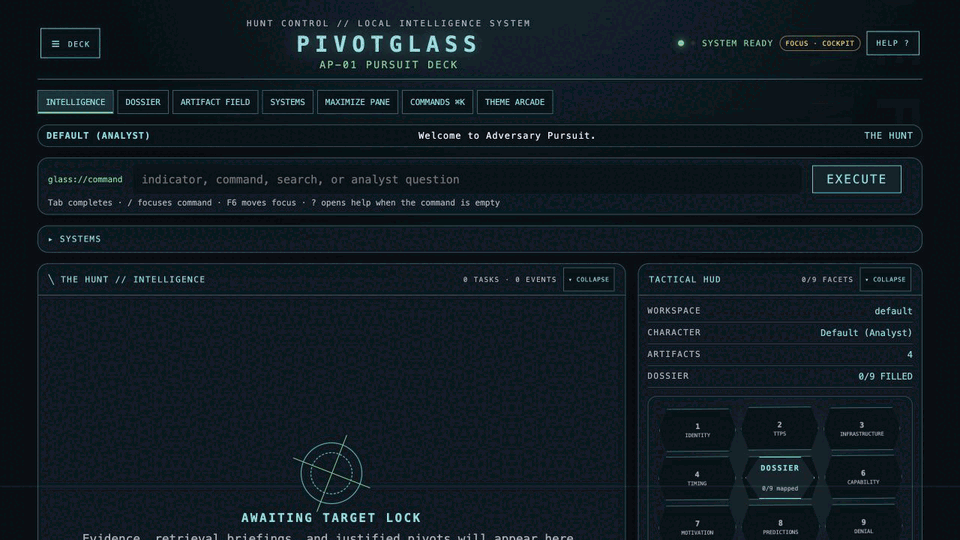
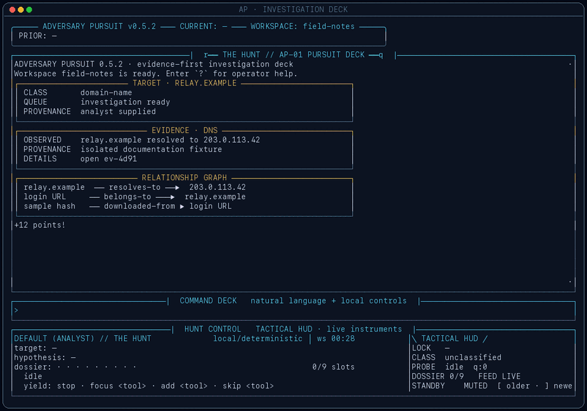

# Adversary Pursuit user guide

Adversary Pursuit (AP) is a local-first investigation cockpit for collecting,
connecting, and testing cyber-threat evidence. Pivotglass is the default visual
interface. The terminal cyberdeck offers the same investigation commands in a
keyboard-first layout, and the classic console remains available for direct
module control.





## Start the interface you want

```bash
ap             # Pivotglass web cockpit
ap web         # same as bare ap
ap tui         # full-screen terminal cyberdeck
ap basic       # classic direct-control console
ap repl        # alias for the classic console
```

Pivotglass prints its local address when it starts and opens the browser when
the platform permits. It serves only local packaged assets; no hosted UI is
required.

## Investigation workflow

1. Enter an IP address, domain, URL, email address, or hash in the command field.
2. Review the proposed probes and choose **Run next** or **Run all**.
3. Read probe state in the Task Constellation. Each literal 3×3-pixel LED is a
   compact status summary; hover or focus for a preview and activate it for the
   complete ordered event history.
4. Use the Artifact Field to inspect discovered indicators. The visible button
   is the actual indicator, shortened only in the middle when necessary.
   Country flags and known-malware marks appear only when backed by stored
   source data.
5. Click **Queue** on a newly discovered indicator to pivot without retyping it.
6. Open Dossier facets to distinguish present evidence from gaps, inference,
   and uncertainty.
7. Export JSON, CSV, STIX, or GEXF, or generate a Markdown report when the
   investigation is ready to share.

Natural-language questions go to the configured model only when local command
routing cannot answer them. Direct tools and stored evidence remain the source
of observed facts. Character narration, music, visual effects, scores, and
mini-games carry no analytical meaning.

## Shared commands

Pivotglass and the terminal cyberdeck complete and execute the same command
families:

| Command | Purpose |
| --- | --- |
| `workspace list` | List investigations |
| `workspace create <name>` | Create and switch to a workspace |
| `workspace switch <name>` | Switch investigations |
| `workspace export <name>` | Export a portable workspace archive |
| `workspace merge <source> <destination>` | Merge evidence without discarding either source |
| `workspace delete <name> --confirm <name>` | Delete only after exact confirmation |
| `mode list` / `mode <name>` | Inspect or select the public character |
| `use <indicator>` | Set an investigation target |
| `search [type]` | Search stored workspace evidence |
| `graph` | Summarize and export relationships |
| `dossier` / `gaps` | Inspect coverage and missing evidence |
| `timeline` | Organize stored events chronologically |
| `note <text>` | Add an analyst annotation |
| `report generate` | Build a source-grounded report |
| `export json\|csv\|stix\|gexf` | Save investigation data |
| `hint`, `challenges`, `autopivot on\|off` | Use optional game and pivot controls |
| `model show` / `model select` | Inspect or configure the model |
| `theme light\|dark\|high` | Change accessibility presentation |
| `help` / `?` | Open command and workflow help |

Tab completes commands and their relevant arguments. In Pivotglass, arrow keys
move through suggestions and Enter accepts one. A `?` typed in an editable
field remains text; outside an editable field it opens Help.

## Terminal navigation

The terminal cyberdeck keeps the complete current-session transcript.

- `[` / `]`, Page Up/Page Down, the mouse wheel, and the right-side scrollbar
  move through the intelligence feed. Up/Down remain command-history keys.
- `search <text>` finds transcript and workspace material.
- `open <event-reference>` opens stored evidence detail.
- `back` returns to the exact previous reading position and focus.
- Alt-M is the immediate soundtrack mute control.

The input line retains normal command history and Tab completion while the feed
has independent scroll state.

## Characters and atmosphere

The public deck contains Default (Analyst), Chuck Norris, HAL9000, Troll,
Sherlock Holmes, Neuromancer, and The Matrix. Every character changes palette,
motion, voice, diversion, and an original procedural score.

Character flavor rotates through a reviewed line bank. Important dossier
breakthroughs may occasionally receive one newly generated line when a model is
configured. That prompt explicitly forbids adding facts, confidence, tool
results, scores, or control-state claims. Operational acknowledgements and
errors remain deterministic.

Music starts muted, persists its enabled state across character changes, and
cross-fades when a score starts, stops, or changes. It is generated locally from
changing motif, harmony, bass, percussion, counterline, and atmosphere layers;
it does not stream or repeat a fixed recording.

Pivotglass offers themed Day/Night and high-contrast controls. Terminal
equivalents are:

```bash
AP_TUI_COLOR_SCHEME=light ap tui
AP_TUI_HIGH_CONTRAST=1 ap tui
```

## Configuration and safety

AP stores configuration under `~/.ap/config.toml` and workspaces under `~/.ap/`.
Provider setup writes restrictive file permissions. Use `model select` to
configure or replace a model provider, and configure intelligence-service keys
through the supported setup path or environment variables documented by each
module.

External intelligence can be incomplete, stale, biased, or wrong. Treat source
responses as observations with provenance, distinguish them from inference, and
verify consequential conclusions at the originating service.
