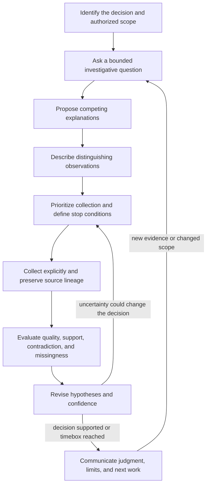

# Investigating with disciplined reasoning

[Documentation home](../README.md) · [Worked example](WORKED_EXAMPLE.md) · [Visual analysis](VISUALIZATIONS.md) · [Learning through practice](LEARNING.md)

A security analyst often begins with a fragment: a domain in an alert, a report,
a suspicious connection, or a colleague's concern. The hard part is deciding
what that fragment establishes, what remains unknown, and which next action
would change the decision. More indicators alone do not answer those questions.

Pivotglass connects sourced evidence to a reviewable investigation notebook.
It helps the analyst keep the question visible, compare alternatives, preserve
contradictions, and hand off both findings and unfinished work. This can reduce
repeated reconstruction of context and make gaps easier to inspect. These are
design mechanisms; the project does not claim a measured improvement in analyst
speed, accuracy, or training outcomes.

## The scientific investigation loop



Scientific discipline here means making reasoning testable and revisable.
Security investigations often use incomplete historical observations rather
than controlled experiments. Do not describe an absence in an incomplete log
as a failed prediction without first establishing the relevant visibility.
Do not touch suspicious infrastructure to test a hypothesis without authority.

### 1. Frame the decision and question

“Is this domain bad?” leaves the meaning, scope, and required action undefined.
A better question is: “Do the observed connections from host A to domain B during
this interval justify containment, or is additional endpoint evidence needed?”
State what data you have, its provenance, the time window, the affected scope,
and what the result is meant to support. Unknowns are useful inputs. Novice
Mode's Q&A helps draft questions; review them before saving.

### 2. Separate observations from explanations

| Record | Example | How to handle it |
| --- | --- | --- |
| Observation | A named proxy source records a connection at a stated time | Preserve its source and collection context |
| Inference | The pattern may be periodic beaconing | Explain the reasoning and alternatives |
| Assumption | The sensor clock was synchronized | State how failure would affect the judgment |
| Hypothesis | A compromised endpoint generated the traffic | Define what would support or contradict it |
| Judgment | Containment is warranted under the stated decision criteria | Explain evidence, uncertainty, and consequences |

An immutable observation preserves what was collected; it does not certify the
source's accuracy. A model may propose reasoning, but fluency is not evidence.

### 3. Make alternatives and predictions explicit

Include plausible benign and competing malicious explanations. For each, ask:
“If this were true, what would I expect to observe? What finding would weaken
it? Can our available sources actually observe that finding?”

Record predictions and signposts before searching only for confirmation. A
prediction describes an expected observation; a signpost describes a development
that would change a judgment or decision. They are planning records, not proof
that an event occurred.

### 4. Choose information that changes the decision

A collection requirement should explain why the information matters. Pivotglass
ranks declared decision impact, discriminating power, time sensitivity, and
feasibility using a deterministic policy. Missing factors score zero. Explicit
analyst priorities override the computed ranking. The score is a planning aid;
it is neither a probability nor an automatic collection instruction.

Set stop conditions such as a decision threshold, collection boundary, or
timebox. An inconclusive investigation can still produce a useful result:
which possibilities remain, why, and what collection would distinguish them.

### 5. Compare, challenge, and revise

Use explicit evidence links to state support or contradiction and a rationale.
Give diagnostic evidence more consideration than a large pile of facts that fit
every hypothesis. Examine source dependence before counting corroboration.
Retain material conflicts and specify what would resolve them.

Likelihood describes how probable the proposition is judged to be. Analytic
confidence describes the strength of its evidential and reasoning basis. Dossier
coverage describes investigation completeness. Keep all three separate.

### 6. Communicate a reviewable conclusion

Explain the question, judgment, evidence, alternatives, confidence basis,
material contradictions, limitations, and unresolved gaps. Include what could
change the answer. Reports and exports preserve the recorded analytic work;
review them for scope and sensitivity before sharing.

## Structured Analytic Techniques: what the application supports

Structured Analytic Techniques (SATs) make selected parts of reasoning explicit
and open to challenge. They help organize judgment; filling a form is not proof
that bias has been eliminated. Pivotglass records seven versioned protocols.

| Technique | Inputs recorded | Outputs recorded | Analyst's substantive work |
| --- | --- | --- | --- |
| Quality of Information Check | `source_ids` | `assessments`, `gaps` | Assess source access, quality, currency, relevance, and dependence |
| Key Assumptions Check | `assumptions` | `challenged_assumptions`, `implications` | Explain which assumptions carry the conclusion and how to test them |
| Analysis of Competing Hypotheses (ACH) | `hypothesis_ids`, `evidence_ids` | `matrix`, `least_inconsistent`, `sensitivity` | Compare diagnostic inconsistencies and test sensitivity to weak evidence |
| Indicators and Signposts | `hypothesis_id` | `signposts`, `thresholds` | Define observable developments and decision-changing thresholds |
| Devil's Advocacy | `judgment_id` | `challenge`, `alternative_explanation` | Construct a strong sourced challenge to the leading explanation |
| Premortem Analysis | `judgment_id` | `failure_modes`, `mitigations` | Imagine the judgment proved wrong and identify preventable failure paths |
| Chronology and Timeline Analysis | `event_ids` | `ordered_events`, `gaps`, `temporal_conflicts` | Separate event time from collection time and reconcile conflicting sequences |

**Implemented:** required field presence, persisted run inputs and outputs,
protocol version, author, completion state, and explicit human disposition.
The visual ACH projection uses recorded evidence links.

**Performed by the analyst:** source-quality evaluation, semantic adequacy of
the submitted records, diagnostic weighting, alternative selection, sensitivity
analysis, and the judgment that one hypothesis is least inconsistent. The run
contract does not automatically validate every ID embedded in JSON or compute
an ACH winner.

**Outside this feature:** proof of attribution, calibrated predictive accuracy,
automatically certified analytical competence, controlled experiments against
external systems, and guaranteed elimination of cognitive bias.

### A repeatable SAT walkthrough

1. Record an investigative question and copy its returned ID.
2. Choose the technique that addresses the current reasoning weakness.
3. Gather the exact input records and write down your rationale.
4. Start a method run with the required input fields.
5. Perform the technique; retain dissent, uncertainty, and weak assumptions.
6. Complete the run with all required output fields.
7. Review and explicitly accept, reject, or revise the completed work.
8. Update the collection plan or judgment if the method changed your reasoning.

Example commands inside Pivotglass; replace placeholder IDs with real records:

```text
analysis methods
analysis question Could shared infrastructure explain the observed overlap?
analysis assumption Infrastructure overlap implies common control.
analysis method start <question-id> key_assumptions_check {"assumptions":["<assumption-id>"]}
analysis method complete <run-id> {"challenged_assumptions":["<assumption-id>"],"implications":["Seek time-bounded independent tenancy evidence before inferring control."]}
analysis method accept <run-id>
analysis collect Obtain time-bounded hosting tenancy evidence from an authorized source.
analysis gap Hosting tenancy during the observed interval is unknown.
```

Starting or completing a run does not collect external information. Accepting
a method run does not automatically accept its hypotheses. A completed method
can be rejected or revised; an accepted method still deserves challenge when
new evidence appears.

## Choose and perform a technique in the infrastructure case

These are analyst exercises using the synthetic case. They do not describe
additional automatically seeded evidence or method runs.

### Quality of Information Check

List the two synthetic source groups and inspect their collection times and
transformation receipts. In a real case, assess how each source obtained the
information, whether it is current for the question, and whether it depends on
another cited report. Write an assessment for each source and identify the
missing time-bounded tenancy information in `gaps`. Complete the run only when
the result explains what the sources can and cannot establish.

### Key Assumptions Check

State “connected infrastructure implies common control” as an assumption.
Ask when it fails: shared hosting, reassignment, a reporting artifact, or an
incomplete time window. Record which assumptions are challenged and what would
change the collection plan. The command example above demonstrates this run.

### Analysis of Competing Hypotheses

Start with common control and shared infrastructure. Include additional
plausible explanations if these do not cover the decision. Compare the same
source-grounded information against each hypothesis. Identify information that
distinguishes them, examine inconsistencies, and test whether removing a weak
or dependent source changes the judgment. Record the matrix, your reasoned
least-inconsistent assessment, and sensitivity result. Retain unresolved
alternatives and identify a future observation that would change the answer.
This follows the comparative discipline described in Richards J. Heuer Jr.'s
[Psychology of Intelligence Analysis, chapter 8](https://www.cia.gov/resources/csi/static/Pyschology-of-Intelligence-Analysis.pdf).

Pivotglass's support/contradiction display is a limited recorded-stance
projection. It is not a complete implementation of every ACH scoring convention.
Do not convert the count of supporting cells into a probability or declare
common control merely because it has more green cells.

### Indicators and Signposts

For common control, specify what time-bounded evidence you would expect if the
hypothesis were true. A signpost might be an independent source establishing
overlapping tenant control during the interval. Explain the threshold that
would change the decision and the source capable of observing it. Record
`signposts` and `thresholds`; the act of writing them does not monitor external
systems or prove they occurred.

### Devil's Advocacy

Select the leading judgment. Construct the strongest supported challenge,
such as address sharing or reassignment within the relevant interval. Identify
which recorded evidence fits that alternative and which needed evidence is
absent. Record the challenge and alternative explanation. A useful challenge
has a basis; inventing an unsupported adversary story is not adversarial rigor.

### Premortem Analysis

Assume a reviewer later finds the common-control conclusion wrong. List
plausible reasons: dependent reports counted twice, allocation changes ignored,
collection time substituted for event time, or a graph grouping mistaken for
control. Record mitigations such as an independent tenancy source, an explicit
visibility statement, and peer review. These are prospective failure modes,
not observations that those errors already occurred.

### Chronology and Timeline Analysis

Identify actual sourced event records and their time meanings. Place events in
order, preserving uncertainty and conflicting time bounds. Collection receipts
in the fixture describe when records were fetched; they do not automatically
establish when the underlying activity started. Record ordered events, gaps,
and temporal conflicts without filling unavailable dates. The provenance trail
answers how the analyst reached the record; an incident chronology answers
what happened when. Keep those questions separate.

## Tradecraft references and limits

The [ODNI Analytic Standards directive](https://www.dni.gov/files/documents/ICD/ICD-203.pdf)
distinguishes uncertainty about a proposition from confidence in its analytic
basis and asks analysts to explain material uncertainty. Pivotglass uses that
distinction in its separate records. This is a design alignment, not an
assertion of directive compliance, government endorsement, or certification.

The methods above organize reasoning and make it reviewable. Their usefulness
in a given case depends on the analyst's source access, skill, peer challenge,
and ability to revise. A recorded protocol does not establish accuracy by itself.

For the full executable command contract and confidence-factor example, see
[Analytic method reference](../ANALYTIC_METHOD.md). Practice first with the
[offline worked example](WORKED_EXAMPLE.md).
