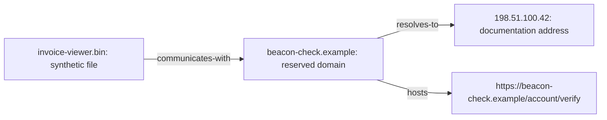
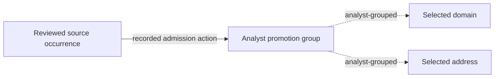
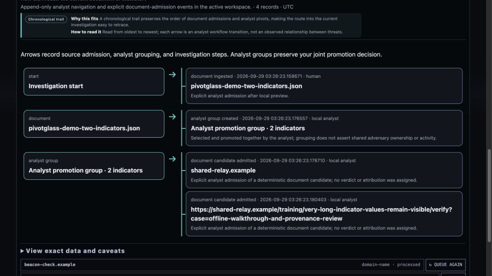

# Visual analysis: choose a view that answers a question

[Analytic method](README.md) · [Worked example](WORKED_EXAMPLE.md) · [Visualization policy](../VISUALIZATION_GUIDE.md)

A visualization is useful when it reduces the effort of comparing evidence,
finding a gap, reconstructing a path, or choosing the next collection action.
Pivotglass pairs a visual with its scope, limits, reading guidance, and exact
data. Use the view to find the next record to inspect, then inspect that record
before making a judgment.

## Relationship graph: follow an actual connection

This current screenshot uses synthetic training data: six entities plus one
recorded analyst admission group, with three stored relationships and two
manual group edges. The diagram below shows the original offline fixture
subset of four entities and three stored relationship types. It is conceptual,
not a reproduction of the complete seven-node screenshot or a claim about real
infrastructure.

**Question:** Which recorded relationships connect the file to the address?

**Useful action:** Select the domain, inspect its typed links and provenance,
then ask whether the relationship timing supports the investigative question.
Search by the actual indicator value; pan, zoom, pin, collapse, or save a layout
to keep a tractable neighborhood in view.

**Limit:** The connected component does not prove common control. A stored
relationship preserves what the source reported; a property pivot supports
navigation; an analyst assertion records judgment. Read the edge class and its
basis. Spatial proximity is only layout. The force view displays at most 48
filtered nodes, and the inventory exposes the broader bounded graph scope.

## Admission groups: preserve an analyst's organizing decision

Conceptual admission-history example:

The analyst promoted these candidates together. The grouping preserves workflow
context without claiming they communicate, share an owner, or belong to an
adversary. Use it to recover why nodes entered the investigation together and
to ask which claimed connections still need evidence. An older admission with
no recorded joint group is not retroactively reconstructed as one.

The additional two entities entered through explicit joint candidate admission.
Use their group to find the common source and admission rationale, then inspect
its exact spans and the source's claims before judging a threat connection.
Grouping answers “why did these enter this case together?” It does not answer
“does one adversary control them?” That second question needs sourced support,
alternatives, and an explicit analytic assessment.

## Provenance history: reconstruct how the case grew

**Question:** How did this source or indicator enter the workspace, and what
recorded pivot led here?

**Useful action:** Follow recorded source, group, and candidate admission
branches. Check the operator, time, action, and basis. Distinguish collection
history from event chronology: when the analyst discovered something can be
much later than when it happened.

**Limit:** A workflow path is not an attack path. Missing prior events mean
unrecorded history, not evidence that no prior activity occurred. This view
projects stored pivot records and cannot recover actions the system never
recorded.

## ACH matrix: compare the same evidence across alternatives

This table is an illustrative analyst exercise, not an automatically calculated
matrix or a claim that these extra observations exist in the learning fixture.

| Evidence considered | H1: common control | H2: shared infrastructure | Next question |
| --- | --- | --- | --- |
| Same domain appears in two reports | Consistent, weakly diagnostic | Consistent, weakly diagnostic | Are the sources independent? |
| Hosts share an address | Consistent | Consistent | Was it multi-tenant at the relevant time? |
| Independent time-bounded tenancy evidence | Not assessed | Not assessed | Can authorized collection obtain it? |

**Useful action:** Find evidence that separates the hypotheses instead of
counting how many facts fit the favored one. In the application, cells project
explicit stored support or contradiction links and their rationales. An empty
cell is unassessed, not neutral. Mixed support and contradiction needs review.

**Limit:** No graph or matrix computes actor identity. The technique's persisted
outputs are authored analytic work. The separate visualization projection
preserves mixed stances; review exact links when the compact notebook matrix
is insufficient.

## Constellation and task matrix: see where work is missing

**Question:** Which investigation dimension repeatedly lacks evidence? Which
indicator-provider job is queued, running, empty, failed, or canceled?

**Useful action:** Read across one indicator to plan its next step, or down one
dimension to find a systematic coverage gap. Inspect a selected cell's exact
count or job state. Use pending and failed work to plan a targeted retry rather
than restarting the entire case.

**Limit:** Coverage measures recorded investigation work. A filled cell does not
mean malicious, a failed job does not mean benign, and an unavailable collection
path does not mean that the question cannot be answered by another source.

## Scientific hierarchy and uncertainty views

A hierarchy groups the question, hypotheses, method runs, and lifecycle records.
Its edges communicate membership and references. Use it to find unsupported
reasoning and unfinished planning; do not read parent-child position as causal
support.

Likelihood intervals show recorded standardized probability terms. Confidence
remains a separate assessment with its stated basis. A narrow or strong-looking
visual does not improve a weakly sourced judgment.

## Before sharing any visualization

1. State the question and workspace scope.
2. Check visible counts, filters, omitted data, and missingness.
3. Inspect the exact values, sources, time boundaries, and edge classes.
4. Label synthetic examples and analyst assertions.
5. Include the alternative explanation and the graphic's main limitation.
6. Export the relevant records and review handling requirements.

A presentation change can help the reader compare facts. It must not create,
remove, or silently reclassify those facts.
