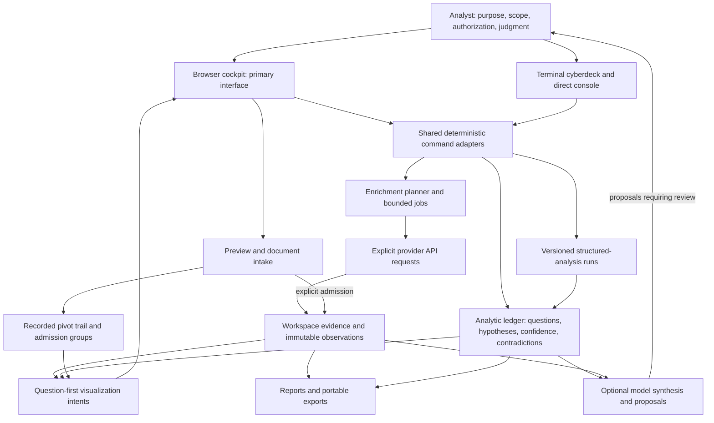
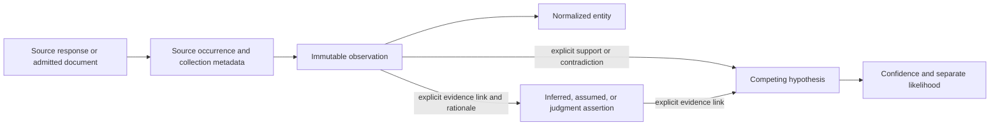

# How Pivotglass works

[Documentation home](../README.md) · [Analytic method](../analysis/README.md) · [User guide](../USER_GUIDE.md)

Pivotglass brings collection, evidence navigation, and scientific reasoning into
one local investigation workspace. Its architecture keeps their authorities
separate so an attractive graph, fluent model response, or convenient shortcut
cannot silently change what the evidence says.

## The system at a glance

This is a logical component diagram, not a claim that every arrow is a separate
network service. The Python application serves the built static browser UI on
loopback and owns workspace state. External providers and optional model
services are network boundaries. The browser also stores presentation
preferences and coaching drafts locally.

## Where authority lives

| Concern | Authority | What it prevents |
| --- | --- | --- |
| Entity and relationship storage | Workspace manager and graph repository | UI geometry inventing relationships |
| Source observations | Workspace observation records | Deduplication erasing separate source histories |
| Questions, assertions, hypotheses, confidence, contradictions | Analytic ledger | A chat response becoming an accepted judgment |
| Structured technique inputs, outputs, review state | Structured analysis workbench | An opaque analysis prompt replacing a reviewable method |
| Collection requirements and ranking | Recorded lifecycle requirements and deterministic scoring policy | Convenient scores appearing without declared factors |
| Document admission and grouping history | Document library and pivot trail | Uploading a file silently collecting its indicators |
| Chart choice, source scope, missingness | Python visualization intents | Renderer-specific interpretation changing the record's meaning |
| Graph position, filters, saved layout, themes, music | Presentation state | Layout or atmosphere becoming evidence |

The implementation is organized under the `pivotglass` Python package. Important
modules include `core/analytic_ledger.py`, `core/analytic_commands.py`,
`core/structured_analysis.py`, `core/document_library.py`,
`core/investigation_graph.py`, and `core/visualization.py`. Browser rendering and
interaction live in `web/app/`; `web/server.py` exposes the local application
routes. These are responsibilities, not alternate stores of analytic truth.

## The evidence-to-judgment path

An entity is a navigation identity; an observation is a particular collected
record about it. One domain reported twice may have one entity and two
observations. Repeated reports can share an upstream source, so observation
count does not establish independent corroboration.

A document candidate is extracted text awaiting review. Admission makes the
selected entity available in the workspace with source lineage. It does not
prove the document's claim, make the entity malicious, or run enrichment.
Candidates admitted together gain a recorded analyst admission group. That
relation means the analyst promoted them together; common ownership requires
separate evidence and judgment.

## Local work and external boundaries

Start the primary interface with `pivotglass`. The direct-control surfaces are
`pivotglass basic` and `pivotglass repl`. Inside a session, `workspace learn
<new-name>` creates an explicitly synthetic offline case without provider or
model requests.

Normal workspace persistence uses SQLite. The application data home is
`~/.pivotglass`; configuration, workspace databases, artifacts, and exports
have different purposes. Consult [Data safety](../DATA_SAFETY.md) and
[Workspace migrations](../WORKSPACE_MIGRATIONS.md) before copying or upgrading
live state. Browser coaching drafts are separate from database-backed notebook
questions and are not included simply because a workspace is exported.

Collection sends authorized indicators to the selected provider. Model
synthesis sends its supplied context to the configured model service. Optional
advisor voice sends the narrated text to the voice service. Local procedural
music has no analytical authority. Review the precise transmission boundaries
in the [User guide](../USER_GUIDE.md) and [Data safety](../DATA_SAFETY.md).

Synapse, SCOT, and local analysis tools have explicit preview, proposal, review,
and execution contracts. Some approved remote operations can write to remote
systems; a local preview is not permission to execute them. Their deployment
and production-validation limits are documented in
[External integrations](../EXTERNAL_INTEGRATIONS.md).

## Resilience and limits

Jobs expose lifecycle state and supported cancellation controls. Failed or
incomplete reads must remain visibly failed or incomplete. Migration validates
a candidate workspace and retains a backup rather than treating a schema
upgrade as routine cleanup. Remote write plans bind approval to the inspected
plan and retain receipts; uncertain outcomes need reconciliation.

Graphs and charts use bounded views. A visible subset is a navigation window,
not the whole case. Read the record counts and omissions before drawing a
conclusion. Measured capacity results in [Capacity](../CAPACITY.md) apply to
the named qualification version and host, not to every installation.

The architecture supports defensible work; it cannot guarantee that a source
is truthful, that alternative hypotheses are exhaustive, that a recorded
technique was performed well, or that an accepted conclusion is correct.

## Trace one current synthetic case through the authorities

The [current visual walkthrough](../analysis/VISUALIZATIONS.md) shows a source
admission group alongside stored entity relationships. Begin at the reviewed
source occurrence and exact candidate span, follow the explicit admission
receipt to the normalized entity, and inspect the edge truth class. Use
`analysis link` to record support or contradiction for a hypothesis with a
rationale. A source claim, group membership, graph position, or model explanation
cannot skip that evidential reasoning step. The source, local workflow decision,
and analyst assessment retain their separate authorities.
