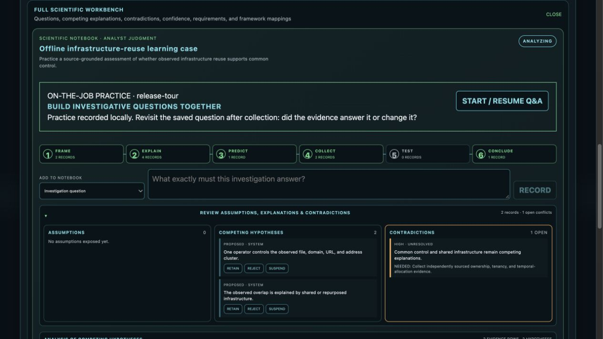
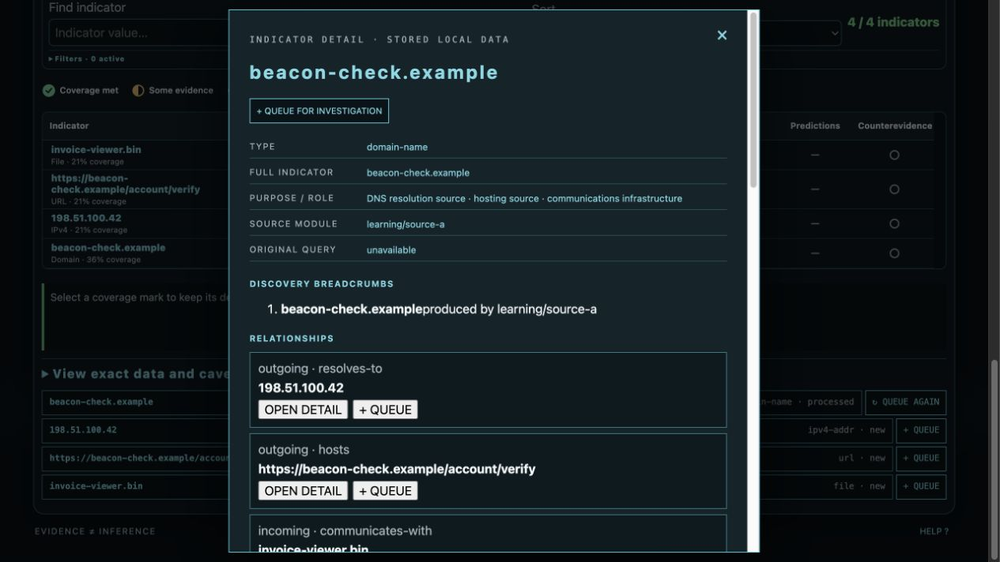
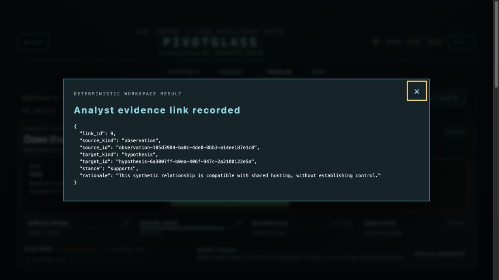
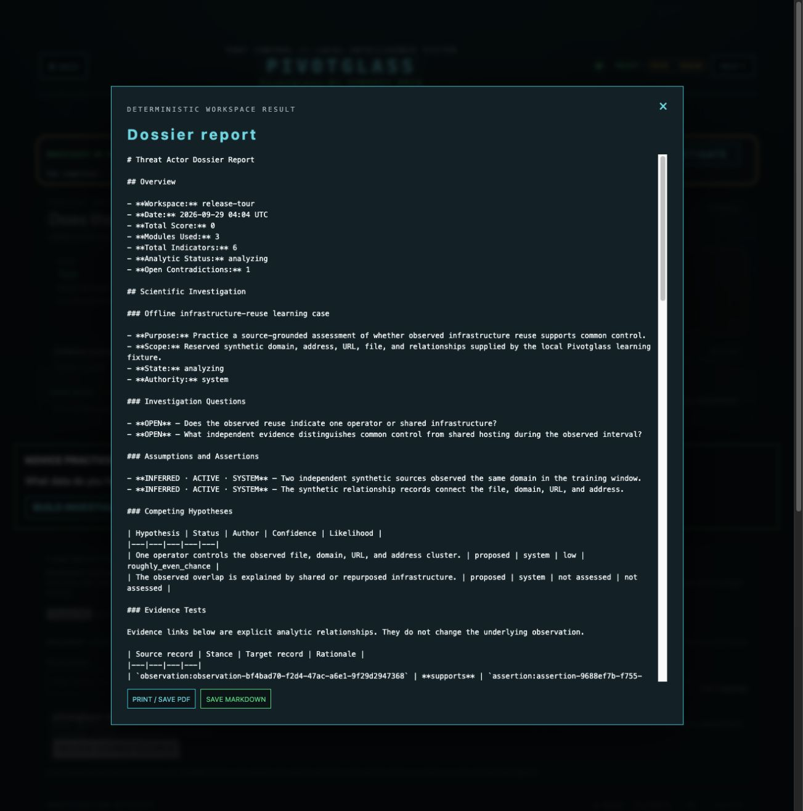

# Pivotglass v0.9.9 demo narration script — final voice pending

Narration script for an edited walkthrough of actual browser interactions in an isolated synthetic workspace. Captured at the normal 1265 × 712 viewport. No live enrichment or model calls. This is not a continuous screen recording.

The system-speech rendition was rejected and removed from the working video.
Natural Descript narration, final timing, and the accepted export remain pending.
The timecodes below describe provisional visual scene holds, not accepted speech alignment.

## Reproduce the case

Run `python scripts/demo_workspace.py` from an installed checkout, open its loopback URL, and follow the offline quickstart. The second document is [the synthetic admission fixture](../examples/demo-two-indicators.json).

## 00:00:00.000 — A question, not a verdict

Welcome to Pivotglass version zero point nine point nine. This edited walkthrough uses real screens from an isolated, synthetic investigation. No live intelligence service or language model is required. The cockpit brings questions, evidence, alternative explanations, and analyst decisions into one workspace.

## 00:00:22.272 — Begin with what you have

Novice mode starts with a conversation. What data do you have? What happened? The question coach helps a new analyst describe the source, the observed event, and the decision the investigation needs to support. Coaching is a practice aid, not a substitute for evidence.

## 00:00:40.776 — Make unknowns explicit

Do you know how it started? Here the analyst explicitly says no. That unknown remains visible. Useful analysis does not fill a missing origin story with a confident guess.

## 00:00:53.055 — Review before saving

The coach proposes investigative questions. The analyst edits a question to ask what independent evidence distinguishes common control from shared hosting. Saving is an explicit decision; a draft becomes a durable question only after review.

## 00:01:09.902 — Practice and reflection

A short reflection records what the analyst practiced. Repeated work builds habits: state the decision, separate observations from assumptions, and identify evidence that could change the conclusion. Practice history records participation, not a certification of expertise.

## 00:01:29.047 — Challenge the favored explanation

The analytical workbench keeps competing hypotheses and contradictory evidence visible. Structured techniques help the analyst challenge a favored explanation. A contradiction is something to investigate and disposition, rather than hide to make a cleaner narrative.

## 00:01:46.370 — See coverage and gaps

The constellation is a navigation aid for the admitted evidence. It helps locate objects and gaps. Position and visual emphasis do not establish adversary ownership, confidence, or importance.

## 00:02:00.396 — Inspect the complete indicator

Open an indicator to inspect its complete value and stored relationships. In this synthetic case, a file communicates with a domain. A relationship supports a specific observation; it does not, by itself, establish common control.

## 00:02:17.609 — Follow the source trail

The detail view exposes provenance and collection history. Source identifiers, timestamps, response hashes, and conflicting results let another analyst examine where an observation came from. A model summary is not the original source.

## 00:02:34.990 — Preview before admission

Local document intake first previews candidates. This synthetic document contains a domain and a deliberately long URL. The analyst selects both, then explicitly admits the source and candidates. Previewing alone does not add evidence to the workspace.

## 00:02:52.330 — Keep the admitted source

The source library retains the admitted document and its digest. After restarting the isolated service, the same source and admitted objects remain available. Keeping source material makes review and later correction possible.

## 00:03:07.575 — History records analyst decisions

Provenance history shows the actual workflow: document admission, creation of an analyst promotion group, and two candidate admissions. The branches record the analyst decision to promote these candidates together. They do not assert a shared adversary or an observed threat relationship.

## 00:03:26.870 — Distinguish relationships from grouping

The relationship graph now shows seven nodes and five visible edges. Stored relationships use their own edge style; analyst grouping uses dotted yellow edges. The long URL wraps inside its label. The analyst can read the complete value and distinguish grouping from evidence.

## 00:03:45.308 — Explain the evidence connection

The analyst records an explicit evidence link with a rationale. Here, a synthetic observation supports the shared hosting alternative without establishing control. The ledger stores the link as an analyst judgment, preserving the observation and the competing hypothesis.

## 00:04:03.153 — Prepare a reviewable handoff

Generate a deterministic report from the current workspace. The report retains the investigative questions, alternative explanations, explicit evidence links, unresolved contradictions, and next collection requirements. It is a handoff for review, not an automatic verdict. The analyst still checks the assessment, limitations, and handling before sharing.

## 00:04:28.363 — Start locally; enable services deliberately

Configuration separates optional intelligence and model services from the local workflow. Enable providers deliberately and understand their network and data boundaries. The implementation and operations guides document prerequisites, backup, restore, maintenance, and failure recovery.

## 00:04:48.297 — Presentation stays separate from truth

Personas and themes give the workspace a distinctive atmosphere. This is the Nightgrid presentation. Visuals and optional sound help the working experience; neither changes evidence or analytical authority. Start with the offline quickstart, then follow the user guide through a reviewed, defensible handoff.
