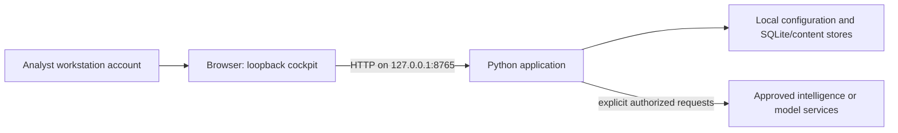

# Infrastructure and requirements

[Implementation](IMPLEMENTATION.md) · [Operations](OPERATIONS.md) · [Compatibility](../COMPATIBILITY.md) · [Capacity](../CAPACITY.md)

Pivotglass's qualified core is a local workstation application. The Python
process owns workspace state and serves a built browser cockpit on loopback.
Its default deployment does not require a graph server, database service,
cloud subscription, model provider, or intelligence-provider account.

## Requirements by use

| Use | Required | Optional or separate |
| --- | --- | --- |
| Reproducible tagged-source install | Python 3.12+, Git, uv, package-download access during setup | Independent release-signature verification tooling |
| Local browser operation | Installed locked Python environment, browser supporting the UI, writable local application storage, free loopback port 8765 | Internet for explicitly requested providers |
| Terminal cyberdeck | `agent` extra installed with the locked environment, usable terminal | Configured model for optional synthesis |
| Direct console | Python runtime and base product dependencies | Provider keys for selected collection |
| Browser rebuild/development | Node.js 20.9+ according to the package engine, npm, locked `web/package-lock.json` | Development server; release runtime uses static export |
| Frontend test harness | A Node runtime able to execute the committed `.test.ts` files directly; the current workstation uses Node 26.3.0 | The package minimum is the build engine constraint, not a test-harness qualification for every older Node |
| Original local document intake | Qualified format and at most 10 MiB per selected file | PDF text/OCR, Office, archives, URL/RSS intake are not qualified |
| Synapse/SCOT or local analysis tools | Separately deployed compatible tool/service and explicit configuration | Production round-trip/recovery qualification remains an additional gate |

Requirements above come from package and command contracts. A minimum engine
version is not a claim that every supported browser, OS, Python patch, or Node
patch has a live release receipt. Consult the current release QA for the
versions actually exercised.

## Local deployment diagram



This is a deployment boundary diagram. It does not represent provider access as
a permanent connection or imply that the browser state is the evidence authority.

## Network and access boundary

The ordinary `pivotglass` launch binds `127.0.0.1:8765`. The CLI does not offer a
production remote-server setup, authenticated multi-user tenancy, or TLS
termination configuration. Programmatic alternate binding is not qualification
for remote operation. Exposing the unauthenticated interface to a LAN changes
the risk boundary; it is outside the qualified local model.

Installation retrieves source and dependencies. The no-key learning fixture
performs no provider or model request. Explicit provider operations can send
indicators to the selected service. URLScan may ask an external service to
visit a submitted target. Optional model synthesis sends supplied context to
the configured provider; optional cloud advisor speech sends narration text.
Do not assume that a keyless provider is offline or that a local model endpoint
has no external dependencies. Record the actual service deployment and policy.

## Storage and confidentiality

Default state lives under `~/.pivotglass`. Configuration can include credentials;
workspace databases include investigative records; sibling `<workspace>.content`
stores hold admitted original document bytes. Reports, exports, migration
backups, and logs may hold sensitive case details. Browser local storage also
holds presentation choices and workspace-scoped coaching context.

Use an account and backup destination appropriate to the case's data handling.
The product does not provide an encrypted evidence vault, centralized role-based
access control, or a fleet-wide retention manager. Workstation encryption,
account controls, managed credential rotation, and backup encryption are local
administrator responsibilities. See [Data safety](../DATA_SAFETY.md).

Do not use a live shared/network database file as an improvised multi-user
backend. Preserve database and raw-source stores together during backup and
recovery. A portable JSON record export is not a full copy of the source bytes.

## Resource sizing: measure the workload

The project has not established a universal minimum CPU count, RAM allocation,
or disk-space guarantee. The dated qualification envelope in [Capacity](../CAPACITY.md)
uses 5,000 stored entities and a 1,000-node connected graph. The force canvas shows
48 filtered nodes and the Constellation bounds its visible scope. These are
record/view boundaries, not promises about every case's memory use.

A traced Python allocation peak excludes browser memory and much native memory;
it is not total process RSS. Provider concurrency, graph density, observations
per entity, raw documents, report history, backups, and export size all affect
sizing. Preserve space for source bytes, database growth, a full stopped-home
backup, and upgrade/recovery copies. Derive the requirement from measured data
rather than using a fixed multiplier as a guarantee.

Run the shipped offline measurement from the actual checkout:

```bash
uv run python scripts/measure_capacity.py --storage-entities 5000 --graph-nodes 1000 --output capacity-receipt.json
```

The receipt records environment, timings, traced allocations, sizes, and omitted
counts. Use the supported exact arguments above. Start with a smaller workload
if the host's resources are uncertain, and preserve the environment/version
alongside any result. The benchmark uses temporary synthetic data and removes
its temporary workspaces.

## Qualification limits

Batch intake, workspaces beyond the dated measured envelope, fixed cancellation
latency during a provider call, authenticated remote serving, multi-user
concurrency, and production-scale SCOT/Synapse authority workloads remain
unqualified. An installation may work outside this envelope; that observation
requires its own receipt before becoming an operational claim.
