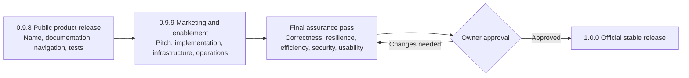

# Pivotglass release roadmap: 0.9.8 → 1.0.0

Owner direction recorded 2026-09-27. This supersedes the release sequencing in
older roadmaps; historical work packages remain useful design context.

## v0.9.8 — product and documentation release

Deliver the current reviewed product under a consistent Pivotglass command and
package identity. Qualify the full suite, verify migration and installed command
paths, document actual capabilities and limitations, and publish verifiable
release artifacts. This is the requested public 0.9.8 release; it is not the
future 1.0 stable-contract declaration.

## v0.9.9 — marketing and enablement

Create audience-specific elevator pitches and implementation guides. Document
infrastructure requirements, deployment/upgrade, operations and maintenance,
automation, ownership, support, backup/recovery, and ongoing verification tasks.
Ground every public claim in delivered behavior. Do not invent performance,
learning-effectiveness, or production-integration results.

Acceptance: an evaluator can explain value, choose an implementation scope,
install deliberately, operate safely, recover data, and identify the owner of
each ongoing task using repository Markdown.

## Final quality pass — prerequisite to v1.0.0

| Lens | Required evidence |
|---|---|
| Correctness | End-to-end analytical and command contracts; no evidence/inference confusion; reproducible export/import and upgrades |
| Resilience | Bounded retries, partial failure, cancellation, restart, interruption, data recovery, and workspace isolation |
| Efficiency | Defined workloads and measured resource/time envelope; justified bottleneck fixes; no invented scale guarantees |
| Security | Scoped security review, secret/network boundaries, dependencies, parser limits, release supply chain, and remediated findings |
| Usability | Novice and experienced task completion, keyboard/focus, readable values, provenance, uncertainty, and recovery affordances |

Deliver a reviewable assurance report with all failures and remaining limits.
The repository owner must approve that final pass before version 1.0.0 is
assigned or published. Completion of 0.9.8 or 0.9.9 is not that approval.

## Integration and intake qualification gates

Earlier plans proposed Synapse primary-store cutover and additional PDF, OCR,
Office, and remote-document formats as v1.0 gates. Those capabilities remain
unqualified until their live parity, recovery, round-trip, and parser tests pass.
The final assurance report must explicitly decide which are in the stable
v1.0 scope and which remain deferred with owner approval. A version advance
alone does not authorize a backend cutover or broaden the format contract.
